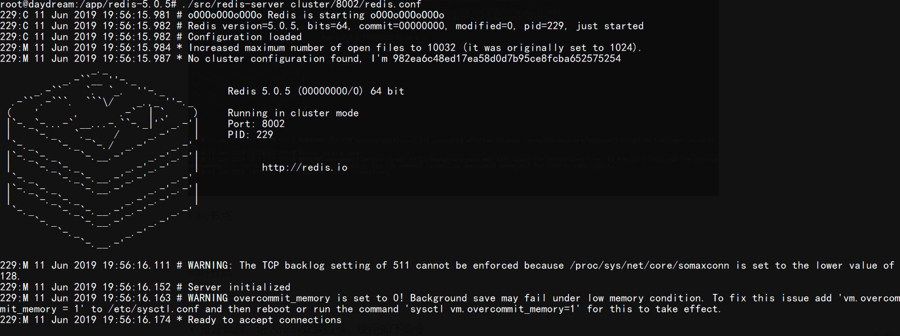
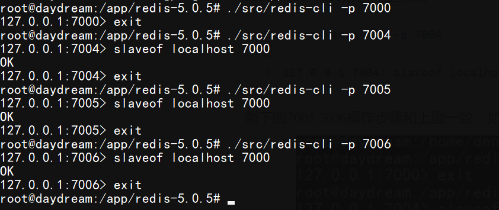

## Redis 主从集群以及对等节点集群搭建以及连接


#### 前言

​	Redis是开源的，内存数据结构存储的健值数据库。用于数据存储，缓存和消息代理。支持的数据结构有字符串，Hash，List，Set，有序集合等等。除此之外，Redis还使用集群来提供高可用性。本文就介绍如何搭建Redis主从集群和Redis对等节点集群。关于Redis的安装部分，可以查看[Redis在Window上的几种安装方法(包含linux)](<https://blog.csdn.net/daydream13580130043/article/details/90734895>)。废话不多说，开始Redis集群搭建之旅（通过端口号来搭建单机版的集群）。

#### 对等节点搭建（三节点）

集群搭建基本命令：

```bash
./src/redis-cli --cluster create host1:port host2:port host3:port
```

+ 首先在redis安装目录下新建cluster文件夹，然后在文件夹里新建8001 8002 8003文件夹

  ```bash
  mkdir cluster
  cd cluster && mkdir 8001 8002 8003
  ```

+  在8001文件夹下新建*redis.conf*文件`vim redis.conf`，添加如下内容

  ```bash
  port 8001 # 指定端口
  cluster-enabled yes # 启用集群
  cluster-config-file nodes-8001.conf # 文件名可以随便起，但是不能重复
  cluster-node-timeout 5000 # 指定超时时间
  appendonly yes 
  ```

+ 将*redis.conf*分别复制到8002, 8003目录中，并且将redis.conf文件里面的8001分别改成8002和8003

  ```bash
  cp redis.conf ../8002
  cp redis.conf ../8003
  ```

+ 分别启动8001 8002 8003节点，在redis安装目录下分别执行以下命令

  ```bash
  ./src/redis-server cluster/8001/redis.conf
  ./src/redis-server cluster/8002/redis.conf
  ./src/redis-server cluster/8003/redis.conf
  ```

8001节点


8002节点



8003节点


+ 搭建集群，进入redis安装目录，使用如下命令

  ```bash
  ./src/redis-cli --cluster create 127.0.0.1:8001 127.0.0.1:8002 127.0.0.1:8003
  ```

  等待分配slot，然后输入yes即可，如下图

  

使用客户端连接集群，Python和Java以及NodeJS

1. Python，使用[aredis](<https://pypi.org/project/aredis/>)包，代码如下

   ```python
   import asyncio
   from aredis import StrictRedisCluster
   
   # 连接集群
   async def create_cluster(*ports: int):
       nodes = list(
           map(lambda port: {"host": "localhost", "port": port}, ports)
       )
       redis = StrictRedisCluster(startup_nodes = nodes)
       await redis.flushdb()
       return redis
   
   
   async def main():
       redis = await create_cluster(8001, 8002, 8003)
       await redis.set("name", "sundial dreams")
       print(await redis.get("name"))
   
   if __name__ == "__main__":
       asyncio.get_event_loop().run_until_complete(main())
   
   ```

   

2. Java，使用[lettuce](<https://lettuce.io/>)包，代码如下

   ```java
   package storm.Reactor;
   
   import io.lettuce.core.RedisURI;
   import io.lettuce.core.cluster.RedisClusterClient;
   import io.lettuce.core.cluster.api.async.RedisClusterAsyncCommands;
   
   import java.util.Arrays;
   import java.util.List;
   import java.util.concurrent.TimeUnit;
   import java.util.stream.Collectors;
   
   public class Cluster {
       static private RedisClusterClient client;
       static private RedisClusterAsyncCommands<String, String> createCluster(List<Integer> ports) {
           List<RedisURI> redisURIS = ports.stream().map(
                   port -> RedisURI.builder().withHost("localhost").withPort(port).build()
           ).collect(Collectors.toList());
           if (client == null) client = RedisClusterClient.create(redisURIS);
           return client.connect().async(); // 使用异步命令
       }
   
       static public void main(String[] args) throws Exception {
           RedisClusterAsyncCommands<String, String> async = createCluster(Arrays.asList(8001, 8002, 8003));
           async.set("name", "sundial dreams").get(1, TimeUnit.MINUTES);
           System.out.println(async.get("name").get(1, TimeUnit.MINUTES));
       }
   }
   ```

   

3. Nodejs，使用[ioredis](<https://github.com/luin/ioredis>)包，代码如下:

   ```javascript
   const Redis = require("ioredis");
   async function main() {
       const nodes = [8001, 8002, 8003].map(port => ({ host: "localhost", port }));
       const cluster = new Redis.Cluster(nodes);
       await cluster.set("name", "sundial dreams");
       console.log(await cluster.get("name"));
       /* or 
       cluster.set("name", "sundial dreams").then(() => {
           cluster.get("name").then(console.log)
       })
       */
   }
   main()
   ```

#### 主从集群搭建（一主三从三哨兵）

1. 启动主节点，以7000端口为例，在redis安装目录下输入如下命令

   ```bash
   ./src/redis-server --port 7000
   ```

   通过指定--port参数来启动，也可以将redis.conf的port改为7000然后使用`./src/redis-server redis.conf`来启动

2. 启动三个从节点，分别运行在7004 7005 7006，任然使用指定端口的形式启动，命令如下

   ```bash
   ./src/redis-server --port 7004
   ./src/redis-server --port 7005
   ./src/redis-server --port 7006
   ```

   使用*redis-cli*来将三个从节点连接到主节点，`./src/redis-cli -p port`连接对应端口，使用`slaveof localhost 7000`来连接主节点

   ```bash
   ./src/redis-cli -p 7004
   
   127.0.0.1:7004> slaveof localhost 7000
   ```

   剩下的7005 7006操作步骤和上面一致，如下图所示

   

   在cli下可以使用info replication来查看节点信息

   

   可以看到，节点7004的role(角色)已经变成slave(奴隶)节点了，然后主节点是7000。

3. 启动哨兵节点

   + 首先新建sentinel文件夹，并在文件夹中新建sentinel1.conf文件

     ```bash
     mkdir sentinel
     cd sentinel && touch sentinel1.conf
     ```

     编辑sentinel1.conf

     ```bash
     port 26379
     sentinel monitor mymaster 127.0.0.1 7000 2 
     ```

     将sentinel1.conf复制两份，并更名为sentinel2.conf和sentinel3.conf

     ```bash
     cp sentinel1.conf sentinel2.conf
     cp sentinel1.conf sentinel3.conf
     ```

     将sentinel2.conf的port 修改为26380，sentinel3.conf的port 修改为26381

   + 运行哨兵节点

     ```bash
     ./src/redis-server sentinel/sentinel1.conf --sentinel
     ./src/redis-server sentinel/sentinel2.conf --sentinel
     ./src/redis-server sentinel/sentinel3.conf --sentinel
     ```

     26380哨兵节点

     

     可以看到master节点为7000，并且连接着的从节点(slave slave)有7006, 7005, 7004，然后哨兵节点(sentinel sentinel)有26380, 26379。到此为止一主三从三哨兵的集群搭建完成。

     

3. 使用客户端连接集群，Java和NodeJS

   + Java，使用[luttuce](<https://lettuce.io/>)包，连接代码如下

     ```java
     package storm.Reactor;
     
     import io.lettuce.core.RedisClient;
     import io.lettuce.core.RedisURI;
     import io.lettuce.core.api.async.RedisAsyncCommands;
     import io.lettuce.core.cluster.RedisClusterClient;
     import io.lettuce.core.cluster.api.async.RedisClusterAsyncCommands;
     
     import java.util.List;
     import java.util.concurrent.TimeUnit;
     import java.util.stream.Collectors;
     
     public class Cluster {
         static private RedisClient redisClient;
         // 连接一主三从三哨兵集群
         static private RedisAsyncCommands<String, String> createSentinel(RedisURI uri){
             if (redisClient == null) redisClient = RedisClient.create(uri);
             return redisClient.connect().async();
         }
     
         static public void main(String[] args) throws Exception {
             RedisAsyncCommands<String, String> async = createSentinel(
                     RedisURI.builder().withSentinel("localhost", 26379)
                     .withSentinel("localhost", 26380)
                     .withSentinel("localhost", 26381)
                     .withSentinelMasterId("mymaster")
                     .build()
             );
             async.set("name", "sundial dreams").get(1, TimeUnit.MINUTES);
             System.out.println(async.get("name").get(1, TimeUnit.MINUTES));
         }
     }
     ```

     + NodeJS，使用[ioredis](<https://github.com/luin/ioredis>)包，代码如下

     ```javascript
     const Redis = require("ioredis");
     async function main() {
         const sentinelNodes = [26379, 26380, 26381].map(port => ({ host: "localhost", port }));
         const sentinel = new Redis({
             sentinels: sentinelNodes,
             name: "mymaster"
         });
         await sentinel.set("name", "sundial dreams");
         console.log(await sentinel.get("name"));
         /* or
         sentinel.set("name", "dpf").then(() => {
             sentinel.get("name").then(value => {
               console.log(value)  
             })
         })
         */
     }
     main()
     ```

   本文主要介绍了如何使用redis（基于redis5）来搭建主从集群和对等节点集群，搭建步骤其实并不复杂，然后还顺便介绍了如何使用python，java，nodejs来连接搭建的这两类集群。最后，如果读者觉得这篇文章有帮助，别忘了点个赞哦。