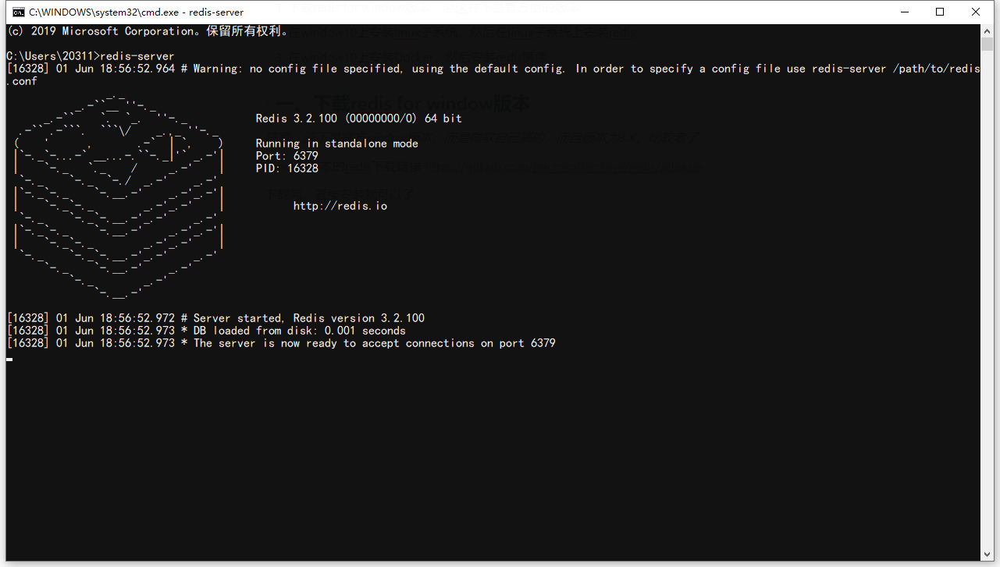

# redis在window10 几种安装方式

​	

[redis](<https://redis.io/)作为一种健值数据库，目前最新版本的只支持linux，但并不意味着不能在window上用redis，下面总结了几种在window安装使用的方法。

1. 下载redis for window版本，但这并不是官方给的版本
2. 在window10上安装Linux子系统，然后在Linux子系统上安装redis
3. 在window10上安装Docker，然后安装redis镜像

### 一、下载redis for window版本

*注意：这不是官方window版本，而是微软自己搞的，而且版本为3.X，比较老了*

window版本的redis下载链接 <https://github.com/microsoftarchive/redis/releases>

下载完，直接安装就可以了，安装完可以在cmd下运行`redis-server`，如下



而配置文件就在redis安装目录下，名字叫做_redis.windows.conf_ ，如果要改运行端口号改它里面的配置就可以了。

由于版本比较老，很多redis现在的新特性，比如stream等都没有，如果想学的比较全的话，建议不要安装这种版本。

### 二、下载Linux子系统，安装redis

其实在window10上直接就有一个Linux子系统，相当于一个Linux命令行窗口，因此可以在Linux子系统上安装redis。

> 1. 首先下载Linux子系统，直接上微软的应用商店搜索_Ubuntu 18.04 LTS_，下载安装即可
>
>    
>
>    安装完之后需要打开`控制面板 > 程序 > 程序和功能 > 启用或关闭window功能` 把**适用于Linux的Windows子系统**给打开
>
>    
>
>    需要重启电脑，之后就会在window磁铁上有Linux了，点击运行即可
>
>    
>

>   2. 在Linux子系统上安装redis（该过程适用于在真正的Linux上安装）
>
>    安装gcc和make
>
>    ```bash
>    sudo apt-get install gcc
>    sudo apt-get install make
>    ```
>
>    下载redis5的包
>
>    ```bash
>    sudo wget http://download.redis.io/releases/redis-5.0.5.tar.gz
>    ```
>
>    解压缩
>
>    ```bash
>    sudo tar xzf redis-5.0.5.tar.gz
>    ```
>
>    进入redis目录，执行make命令(过程可能比较长)
>
>    ```bash
>    cd redis-5.0.5
>    make
>    ```
>
>    如果没有出现错误的话，基本上就代表安装成功了，执行以下命令启动redis数据库
>
>    ```bash
>    ./src/redis-server
>    ```
>
>    不出意外的话是这样的
>
>   
>

>    3. 默认运行在6379端口，可以另起一个Linux命令行，同样进入到redis-5.0.5目录，然后
>
>    ```bash
>    ./src/redis-cli
>    ```
>
>    来测试连接
>
>    或者使用window上的redis客户端，比如 [RedisDesktopManager](<https://redisdesktop.com/download>) (正版要钱，下个破解版吧)
>
>    
>
>    或者写个代码测试一下连接
>
>    ```javascript
>    const Redis = require("ioredis");
>    const redis = new Redis();
>    (async () => {
>        await  redis.set("name", "hello");
>        let data = await redis.get("name");
>        console.log(data);
>    })();
>    // or
>    redis.set("name", "dpf").then(() => {
>        redis.get("name", (err, data) => {
>            console.log(data)
>        })
>    });
>    ```
>
>    

使用这种方法安装redis，可以让redis跑在Linux子系统里，然后在window上写代码，而且Linux子系统与window直接共用一个端口，所以连接redis时也很方便。

### 三、借助docker来安装redis

首先简单介绍一下Docker

##### 问题一 为什么需要Docker?

> 环境配置问题：软件开发最大的麻烦事，通常需要保证操作系统的设置，各种库和组件的安装。经常换一台机器就要重新配置一遍环境。
>
> 虚拟机：为解决上述问题，可以考虑把软件安装到虚拟机上，在虚拟机上配置好各种环境，然后再把虚拟机安装到机器上。仔细想想，安装一个软件变成安装一个虚拟机，属时有点傻逼。
>
> Linux容器：Linux容器并不是模拟一个完整的操作系统，而是对进程进行隔离。相当于在正常进程中套了一个保护层，对于容器里的进程来说，它接触到的各种资源都是虚拟的，从而实现与底层系统的隔离。
>
> Docker：Docker其实就是对Linux容器的一种封装，提供简单易用的API

##### 问题二 Docker是什么?

>Docker是一个开源的应用容器引擎（基于GO开发），让开发者可以打包他们的应用以及依赖包到一个可移植的容器中，然后发布到任何流行的Linux机器上,也可以实现虚拟化,容器是完全使用沙箱机制,相互之间不会有任何接口。
>
>主要由下面几个部分组成
>
>+ Docker Client
>+ Docker Daemon
>+ Docker Image
>+ Docker Container

> Docker Container(容器)：容器是一个标准的软件单元，它将代码及其所有依赖关系打包，以便应用程序从一个计算环境快速可靠地运行到另一个计算环境。Docker容器映像是一个轻量级、独立的可执行软件包，包含运行应用程序所需的一切：代码，运行时，系统工具，系统库和设置。
>
> Docker Image(镜像)：Docker镜像是一个特殊的文件系统，除了提供容器运行时所需的程序、库、资源、配置等文件外，还包含了一些为运行时准备的一些配置参数（如匿名卷、环境变量、用户等）。镜像不包含任何动态数据，其内容在构建之后也不会被改变。
>
> 简单理解过来就是容器相当于面向对象的实例，镜像相当于面向对象的类
>
> Docker 仓库：存放镜像的仓库，可以直接从那里pull一个镜像下来

##### 准备工作 安装Docker

> **注意：Docker只能在window10专业版，企业版，教育版上可用，window10家庭版无法安装，原因是window10家庭版没有Docker依赖的Hyper-V功能**

> 1. 启用Hyper-V功能，`控制面板 > 程序 > 程序和功能 > 启用或关闭window功能` 勾选上Hyper-V，然后重启即可
>
>    

> 2. 官网下载Docker，链接：<https://hub.docker.com/?overlay=onboarding>，下载时需要自己注册一个Docker账号

> 3. 下载下来点击安装，一路下一步即可

> 4. 配置mirrors加速（否则拉取image会很慢）,`docker setting > deamon > Register mirrors` 填入https://dockerhub.azk8s.cn](https://dockerhub.azk8s.cn/

##### Docker基础命令

> + 从仓库拉取镜像：docker pull [options] name[:tag | @digest]，详细的命令可以使用docker pull --help查看
> + 镜像相关操作：docker image command，详细命令可以使用docker image --help 查看
> + 容器相关操作：docker container command，详细命令可以使用docker container --help查看
> + 运行容器：docker run [options] image [command] [args...]

##### 安装redis镜像

> 终于到了正题了，docker安装redis镜像非常的简单，只需要从仓库里拉取redis镜像，运行就可以了
>
> 1. 拉取[docker hub](<https://hub.docker.com/>)里的redis镜像
>
>    ```bash
>    docker pull redis
>    ```
>
>    默认使用最新标签
>
> 2. 下载完镜像后再运行即可
>
>    ```bash
>    docker run -d -p 6379:6379 --name some-redis redis
>    ```
>
>    其中some-redis是容器名，可以通过docker container ls查看所有容器，-p是端口映射，将容器内的6379端口映射到6379端口
>
> 3. 外部程序访问即可

总结一下：安装在window上安装redis，可以下载旧版本的redis安装，或者借助容器Linix子系统或者Docker来安装，比较推荐后两者，比较能安装最新版本的redis，很多新特性都能用，比如stream、方便的集群等等