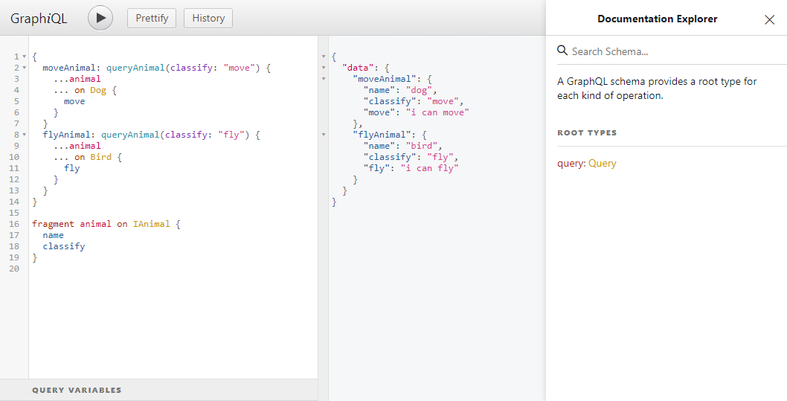

## GraphQL 极速入门


#### 前言 

​    之前在自己的Blog项目 [Blog++](http://www.theaurora.cn) 中使用了GraphQL，发现确实不错，所以写一篇关于GraphQL的入门文章。

###### What is GraphQL？

​    [GraphQL](<https://graphql.cn/>)是一种API查询语言，对API中的数据提供一套描述，使客户端能够准确地获得需要地数据。举个例子，在传统的RESTful API中，如果不对API做出声明，难以知道该API的用途，而且前端无法控制API返回的数据，而GraphQL就是对API的描述，并且前端能控制需要的数据，比如

```javascript
// data 
var data = {
    id: "abcxdesss",
    title: "JS is best language in the world",
    publishTime: "2018-12-12",
    userId: "sundial dreams",
    context: "JS is best language in the world",
    readNumber: 20000,
    starNumber: 2000,
    commentId: "commentId"
}
```

如果是RESTful API的话将会不多不少的返回所有字段，而如果使用GraphQL的话，就可以按需查询

```json
query {
    queryArticle {
      title  # 标题
      publishTime # 发布时间
      context # 内容
    }
}
```

将得到如下数据

```json
{
   "queryArticle": {
       "title": "JS is best language in the world",
       "publishTime": "2018-12-12",
       "context": "JS is best language in the world"
   }
}
```

当然这只是举个简单的例子，以下是总结的GraphQL的优点

1. **请求不多不少的数据**
2. **一个请求即可获得多个资源**
3. **类型系统**
4. **有专门的调试工具**
5. **维护API更容易**

##### 文章目录

本文将从以下几个方面来介绍GraphQL

- **GraphQL基本概念，包括类型、接口、联合类型，query，mutation，片段以及内联片段等**
- **GraphQL的基本使用，主要使用graphqljs来构建GraphQL Schema，使用接口，联合类型等**
- **搭建GraphQL服务**

#### GraphQL基本概念

##### Schema（服务端）

一个基本的Schema通过定义类型和类型字段来创建，比如

```bash
type User {
  name:String!
  age: Int!
}
```

其中String, Int是类型，!表示该字段不能为null。

1. **GraphQL内置的标量类型如下**

- Int: 有符号32位整数

- Float: 有符号双精度浮点数

- String: UTF-8字符序列

- Boolean: true/ false

- ID: ID类型跟String一样，只不过含义不一样

  

2. **枚举类型**

用`enum`关键字定义的类型

```bash
enum Color {
 GREEN
 YELLOW
 RED
 BLUE
}
```

3. **列表**

用`[]`表示

```bash
type MQ {
  id: ID
  queue: [String!]!
}
```

*注：[String]!表示整个列表不能为null，[String!]表示整个列表可以为null，但如果不为null，那么列表里就必须有值，[String!]!前两者的结合*

4. **接口**

用`interface`关键字来定义

```javascript
interface Animal {
  name: String!
}
```

实现接口

```javascript
type Dog implements Animal {
 name: String!
 classify: String
}
```

5. **联合类型**

使用`union`定义的类型

```js
union Result = AType | BType | CType
```

6. **输入类型**

使用`input`定义的类型

```js
input InputUser {
    name: String!
    age: Int!
    sex: Boolean!
    birthday: String!
}
```

使用输入对象类型

```js
type Mutation {
    createUser(user: InputUser): Result
}
```

##### query & mutation查询（客户端）

使用查询来查询定义的Schema

1. **query**

类似于http的GET，基本语法非常简单，结构如下

```
query QueryName {
   query1 {
      field1
      field2
   }
}
```

其中`QueryName`表示查询名，即这次查询的名称，主要用于消除歧义，或者让该查询意思更加清晰，不过也可以省略

来个具体的例子

Schema定义

```js
type Article {
    title: String!
    context: String!
    publishTime: String!
    readNumber: Int
}
    
type Query {
    queryArticle: Article
}    
```

query查询

```bash
query {
    queryArticle {
        title
        context
    }
}
```

在http GET中可以使用`?a=2&b=2`这种形式通过GET请求将数据传给后端，同样的GraphQL的query也能，即带参查询

Schema定义

```bash
type Query {
   queryArticle(title: String!): Article
}
```

query查询

```bash
query {
   queryArticle(title: "JS") {
      title
      context
   }
}
```

除此之外，还提供了别名操作，比如将queryArticle重命名

```bash
query {
    jsArticle: queryArticle(title: "JS") {
       title 
       context
    }
}
```

2. **mutation**

类似于http的POST，语法结构与query类似

```bash
mutation {
   mutation1 {
     field1
     field2
   }
}
```

mutation主要是对后端数据的修改操作，就像POST一样，而query与GET一样只负责查询操作，除此之外与query还有一个主要区别：query是并行执行，而mutation是一个一个执行的

举个例子

Schema

```bash
type Error {
  msg: String
  errno: Int!
}
type Mutation {
  createArticle(title: String!, context: String!): Error
}
```

mutation 

```bash
mutation {
  createArticle(title: "python async/await", context: "python async/await") {
    errno
  }
}
```

3. **片段**

复用重复的字段，即将重复的查询字段抽离成一个片段来复用，片段的定义使用`fragment`关键字，例如

*注：必须与接口或联合类型结合使用*

Schema

```
interface IAnimal {
  name: String!
  classify: String!
}
type Dog implements IAnimal{
  name: String!
  classify: String!
  moveSpeed: Int
}
type Bird implements IAnimal {
  name: String!
  classify: String!
  flySpeed: Int
}
type Query {
  queryAnimal: IAnimal
}
```

query

```bash
query Animal {
  canfly: queryAnimal(classify: "canfly") {
    ...Animal
  }
  canrun: queryAnimal(classify: "canrun") {
    ...Animal
  }
}
fragment Animal on IAnimal {
  name
  classify
}
```

4. **内联片段**

用来去实现接口类型的字段，以上面的schame为例

```bash
query {
  queryAnimal(classify: "canrun") {
    name
    classify
    ... on Dog {
       moveSpeed
    }
  }
}
```

5. **变量**

允许动态的将参数传入到query和mutation查询中

```bash
query Query($data: Data) {
  query1(data: $data) {
    field1
    field2
  }
}
```

7. **指令**

对字段的一系列操作

```bash
query {
  query1(condition: Boolean!) {
    field1 @skip(if: condition)
    field2 @include(if: condition)
  }
}
```

其中`@include(if: Boolean)`仅在参数为true时包含此字段，`@skip(if: Boolean)`仅在参数为true时跳过此字段

#### GraphQL基本使用

##### 基本使用

开始之前，我们需要安装graphql包

```bash
npm install --save graphql
```

开始一个最简单的例子

```javascript
const graphql = require("graphql");
const { buildSchema } = graphql;
// 编写schema
const schemaString = `
  type Article {
     id: ID!
     title: String!
     context: String
     publishTime: String!
     readNumber: Int
     starNumber: Int
     UserId: ID!
     commentId: ID! 
  }
  # 指定根查询
  type Query {
     queryArticle: Article
  }
  # 指定查询
  schema {
    query: Query
  }
`;
const schema = buildSchema(schemaString);
// 定义query
const query = `
  query {
    queryArticle {
      title
      context
      publishTime
    }
  }
`;
const data = {
  id: "abcxdesss",
  title: "JS is best language in the world",
  publishTime: "2018-12-12",
  userId: "sundial dreams",
  context: "JS is best language in the world",
  readNumber: 20000,
  starNumber: 2000,
  commentId: "commentId"
};
const rootValue = {
  // 解析函数，需要与schema 的 queryArticle一致
  queryArticle () {
    // 模拟API调用
    // 或者直接 return data
    return new Promise(resolve => {
      setTimeout(() => resolve(data), 1000)
    });
  }
};
graphql.graphql(schema, query, rootValue)
       .then(({ data: { queryArticle } }) => queryArticle)
       .then(console.log);
```

当然也可以写一个graphQL文件，然后将graphQL Schema都写入到文件里

gql.graphql文件

```json
type Article {
  id: ID!
  title: String!
  context: String
  publishTime: String!
  readNumber: Int
  starNumber: Int
  UserId: ID!
  commentId: ID!
}
type Query {
  queryArticle: Article
}
schema {
  query: Query
}
```

main.js

```js
function readFile (filename) {
  return fs.readFileSync(filename).toString();
}
const schema = buildSchema(readFile("./gql.graphql"));
```

除了使用GraphQL语法来构建Schema和query之外，还可以使用graphqljs来构建

比如

```bash
type User {
  id: ID!
  name: String!
  age: Int
  sex: Boolean
  hobby: [String!]
}
type Query {
  queryUser: [User!] 
}
type Mutation {
  createUser(id: ID!, name: String!): User
}
schema {
  query: Query
  mutation: Mutation
}
```

使用graphqljs来构建就是

```javascript
const {
        graphql,
        GraphQLID,
        GraphQLNonNull,
        GraphQLObjectType,
        GraphQLSchema,
        GraphQLList,
        GraphQLBoolean,
        GraphQLString,
        GraphQLInt
      } = require("graphql");

const UserType = new GraphQLObjectType({
  name: "User", // type User
  fields: {
    id: { type: new GraphQLNonNull(GraphQLID) },
    name: { type: new GraphQLNonNull(GraphQLString) },
    age: { type: GraphQLInt },
    sex: { type: GraphQLBoolean },
    hobby: { type: new GraphQLList(new GraphQLNonNull(GraphQLString)) }
  }
});
const QueryType = new GraphQLObjectType({
  name: "Query",
  fields: {
    queryUser: {
      type: new GraphQLList(new GraphQLNonNull(UserType)),
      resolve (_) { 
        // 为该字段定义一个解析函数
        return [
          { id: "user1", name: "sundial dreams", hobby: ["sleeping"], age: 21, sex: true },
          { id: "user2", name: "daydreams", hobby: ["coding", "movie", "game"] },
        ]
      }
    }
  }
});
const MutationType = new GraphQLObjectType({
  name: "Mutation",
  fields: {
    createUser: {
      type: UserType, // 即返回值类型
      args: { // 即函数参数
        id: { type: new GraphQLNonNull(GraphQLID) },
        name: { type: new GraphQLNonNull(GraphQLString) }
      },
      resolve (_, { id, name }) {
        // 为该字段定义一个解析函数
        console.log(id, name);
        return {
          id, name, age: 21, sex: true, hobby: ["code"]
        }
      }
    }
  }
});

const schema = new GraphQLSchema({
  types: [UserType], // ！！！注册类型
  query: QueryType,
  mutation: MutationType
});

const query = `query {
  user: queryUser {
    id
    name
    hobby
  }
}`;
const mutation = `mutation {
  createUser(id: "user3", name: "dpf") {
    id
    name
  }
}`;
graphql(schema, query).then(({ data: { user } }) => user)
                      .then(console.log);
```

使用上面这种方式构建schema的好处就是比较清晰，而且可以基于nodejs模块化机制，将schema模块化构建

##### 更多实例

1. 接口

   接口Schema定义如下

   ```javascript
   interface IAnimal {
     name: String!
     classify: String!
   }
   type Dog implements IAnimal {
     name: String!
     classify: String!
     move: String
   }
   type Bird implements IAnimal {
     name: String!
     classify: String!
     fly: String
   }
   type Query {
     queryAnimal(classify: String!): IAnimal
   }
   schema {
     query: Query
   }
   ```

   定义两个query查询如下

   ```js
   # 内联查询
   query InlineQuery {
     queryAnimal(classify: "move") {
       name
       ... on Dog {
         move
       }
     }
   }
   
   # 片段 + 内联查询
   fragment animalFragment on IAnimal {
     name
     classify
   }
   
   query FragmentQuery {
     queryAnimal(classify: "fly") {
       ...animalFragment
       ... on Bird {
         fly
       }
     }
   }
   
   ```

   使用graphql包来构建类型，如下

   ```javascript
   const {
           graphql,
           GraphQLSchema,
           GraphQLString,
           GraphQLNonNull,
           GraphQLObjectType,
           GraphQLInterfaceType
         } = require("graphql");
   // 公共字段
   const animalFields = {
     name: { type: new GraphQLNonNull(GraphQLString) },
     classify: { type: new GraphQLNonNull(GraphQLString) }
   };
   
   const AnimalInterface = new GraphQLInterfaceType({
       name: "IAnimal",
       fields: animalFields,
       resolveType (value) { // !!! 需要对接口类型进行运行期转换
         console.log(value); // value 就是 queryAnimal 传过来的
         // 根据 value返回不同的值
         if (value.hasOwnProperty("fly")) return BirdType;
         if (value.hasOwnProperty("move")) return DogType;
         return null;
       }
     }
   );
   
   const DogType = new GraphQLObjectType({
     name: "Dog",
     fields: {
       ...animalFields,
       move: { type: GraphQLString }
     },
     interfaces: [AnimalInterface] // 实现接口
   });
   
   const BirdType = new GraphQLObjectType({
     name: "Bird",
     fields: {
       ...animalFields,
       fly: { type: GraphQLString }
     },
     interfaces: [AnimalInterface] // 实现接口
   });
   
   const QueryType = new GraphQLObjectType({
     name: "Query",
     fields: {
       queryAnimal: {
         type: AnimalInterface,
         args: {
           classify: { type: new GraphQLNonNull(GraphQLString) }
         },
         resolve (_, { classify }) {
           // 解析函数
           console.log(classify);
           if (classify === "fly") return {
             name: "bird",
             classify,
             fly: "i can fly"
           };
           else if (classify === "move") return {
             name: "dog",
             classify,
             move: "i can move"
           };
         }
       }
     }
   });
   
   const schema = new GraphQLSchema({
     types: [AnimalInterface, DogType, BirdType],
     query: QueryType
   });
   
   const query = `
   # 内联查询
   query InlineQuery {
     queryAnimal(classify: "move") {
       name
       ... on Dog {
         move
       }
     }
   }
   `;
   const query2 = `
   # 片段 + 内联查询
   fragment animalFragment on IAnimal {
     name
     classify
   }
   
   query FragmentQuery {
     queryAnimal(classify: "fly") {
       ...animalFragment
       ... on Bird {
         fly
       }
     }
   }
   `;
   graphql(schema, query).then(console.log);
   
   ```

   

2. 联合类型

   Schema定义如下

   ```javascript
   type A {
     a: String
   }
   type B {
     b: String
   }
   type C {
     c: String
   }
   union AllType = A | B | C
   type Query {
     queryAll: [AllType]
   }
   schema {
     query: Query
   }
   ```

   定义一个query查询

   ```bash
   query UnionQuery {
     queryAll {
       ... on A {
         a
       }
       ... on B {
         b
       }
       ... on C {
         c
       }
     }
   }
   ```

   使用graphqljs来构建，如下

   ```js
   const {
           graphql,
           GraphQLSchema,
           GraphQLString,
           GraphQLNonNull,
           GraphQLObjectType,
           GraphQLInterfaceType,
           GraphQLUnionType,
           GraphQLList
   
         } = require("graphql");
   const AType = new GraphQLObjectType({
     name: "A",
     fields: {
       a: { type: GraphQLString }
     }
   });
   const BType = new GraphQLObjectType({
     name: "B",
     fields: {
       b: { type: GraphQLString }
     }
   });
   const CType = new GraphQLObjectType({
     name: "C",
     fields: {
       c: { type: GraphQLString }
     }
   });
   
   const AllTypeUnion = new GraphQLUnionType({
     name: "AllType",
     types: [AType, BType, CType], // 联合类型
     resolveType (value) {
       if (value.hasOwnProperty("a")) return AType;
       if (value.hasOwnProperty("b")) return BType;
       if (value.hasOwnProperty("c")) return CType;
       return null;
     }
   });
   const Query = new GraphQLObjectType({
     name: "Query",
     fields: {
       queryAll: {
         type: new GraphQLList(AllTypeUnion),
         resolve () {
           return [
             { a: "hello world" },
             { b: "main() {}" },
             { c: "sundial dreams" }
           ]
         }
       }
     }
   });
   const schema = new GraphQLSchema({
     types: [AType, BType, CType, AllTypeUnion],
     query: Query
   });
   const query = `
   query UnionQuery {
     all: queryAll {
       ... on A {
         a
       }
       ... on B {
         b
       }
       ... on C {
         c
       }
     }
   }
   `;
   graphql(schema, query).then(({ data: { all } }) => all).then(console.log);
   ```

#### 搭建一个GraphQL服务

会写Schema，那么搭建GraphQL服务就非常简单了，不过还得使用`express-graphql`包

安装`express` `express-graphql`

```bash
npm install --save express express-graphql
```

基本使用

// main.js

```js
const express = require("express");
const graphqlHTTP = require("express-graphql");
const schema = require("./graphql");
const app = express();
app.use("/graphql", graphqlHTTP({
  schema,
  graphiql: true // 启用GraphQL调试器
}));
app.listen(8000, err => console.log(err || "listen in 8000"));
```

// graphql.js 复用之前的例子

```js
const {
        graphql,
        GraphQLSchema,
        GraphQLString,
        GraphQLNonNull,
        GraphQLObjectType,
        GraphQLInterfaceType,
        GraphQLUnionType,
        GraphQLList
      } = require("graphql");
const animalFields = {
  name: { type: new GraphQLNonNull(GraphQLString) },
  classify: { type: new GraphQLNonNull(GraphQLString) }
};
const AnimalInterface = new GraphQLInterfaceType({
    name: "IAnimal",
    fields: animalFields,
    resolveType (value) { // !!! 需要对接口类型进行运行期转换
      console.log(value); // value 就是 queryAnimal 传过来的
      // 根据 value返回不同的值
      if (value.hasOwnProperty("fly")) return BirdType;
      if (value.hasOwnProperty("move")) return DogType;
      return null;
    }
  }
);

const DogType = new GraphQLObjectType({
  name: "Dog",
  fields: {
    ...animalFields,
    move: { type: GraphQLString }
  },
  interfaces: [AnimalInterface] // 实现接口
});

const BirdType = new GraphQLObjectType({
  name: "Bird",
  fields: {
    ...animalFields,
    fly: { type: GraphQLString }
  },
  interfaces: [AnimalInterface] // 实现接口
});

const QueryType = new GraphQLObjectType({
  name: "Query",
  fields: {
    queryAnimal: {
      type: AnimalInterface,
      args: {
        classify: { type: new GraphQLNonNull(GraphQLString) }
      },
      resolve (_, { classify }) { // 解析函数
        console.log(classify);
        // 模拟异步操作
        return new Promise((resolve, reject) => {
          setTimeout(() => { // 延时一秒
            if (classify === "fly") resolve({
              name: "bird",
              classify,
              fly: "i can fly"
            });
            else if (classify === "move") resolve({
              name: "dog",
              classify,
              move: "i can move"
            });
          }, 1000);
        });
        });
      }
    }
  }
});

module.exports = new GraphQLSchema({
  types: [AnimalInterface, DogType, BirdType],
  query: QueryType
});
```

可以在浏览器地址栏上输入 `localhost:8000/graphql`打开调试器



调试器功能比较丰富，比如支持提示，美化查询，历史记录等等，读者可以自行体验

#### 更多参考

graphql官网：https://graphql.cn/learn/

graphqljs：https://graphql.cn/graphql-js/

express-graphql：https://graphql.cn/graphql-js/running-an-express-graphql-server/

**工具类**

Apollo Client(React 的 GraphQL客户端， 同样支持Vue Angular等)：https://www.apollographql.com/docs/react/

Relay(React 的GraphQL客户端): https://relay.dev/docs/en/introduction-to-relay