将C++代码加载到JavaScript中


### 简介

熟悉Node.js的人都知道，Node.js是基于C++开发的一个JavaScript运行时，既然Node.js是用C++开发的，那么我能否将C++代码引入到Node.js中呢，这当然是可以的，这项技术被称为C++模块。官方对Node.js C++模块解释如下

> Node.JS插件是使用C++编写的动态链接库，可以被Node.JS以require的形式载入，在使用时就像Node.js原生模块一样。主要被用于在Node.js的JavaScript和C或者C++库之间建立起桥梁的关系。

动态链接库，即window平台的.dll文件，linux下的.so文件。只不过Node.js模块导出的是.node文件。

> 动态链接库提供了一种方法，使进程可以调用不属于其可执行代码的函数，函数的可执行代码位于一个.dll (window)或.so (linux)文件中，该文件包含一个或多个已被编译、链接并与使用它们的进程分开存储的函数。说到动态链接库，不得不提一下静态链接库，静态链接库是指在编译阶段就把相关的函数库（静态库）链接，合成一个可执行文件。

**那么，为什么需要C++模块?**

JavaScript是基于异步，单线程的语言，对于一些异步任务非常占优势，但对于一些计算密集型的任务，也有明显的劣势（也许这是脚本语言的缺点）。换句话说使用JavaScript解释器执行JavaScript代码的效率通常是比直接执行一个C++编译好的二进制文件效率要低。除此之外，其实很多开源库是基于C++写的，比如图像处理库（ImageMagick），像我们团队使用的图像处理库，也是基于C++编写（用JavaScript写，性能达不到要求），所以对于一些问题使用C++来实现，效率和性能能有显著的提升，何乐而不为呢。

因此本文从C++插件基本原理以及几种编写方式来向读者介绍如何将C++代码加载到JavaScript中（编写Node.js C++模块）

### 原理浅析

前面提到，Node.js的C++模块是以动态链接库存在的(.node)，那么Node.JS是如何加载C++模块的呢。首先Node.js的一个模块时一个遵循CommonJS规范书写的JavaScript源文件(.js)，也可能是一个C++模块二进制文件(.node)，这些文件通过Node.js中的**requier()**函数被引入并使用。

在Node.js中引入C++模块的本质就是在Node.js运行时引入一个动态链接库的过程。在Node.js中通过**require()**函数加载模块，无论是Node.js模块还是C++模块。那么知道这个函数怎么实现的就知道怎么加载模块的。

为了揭开require的正面目，我们翻开Node.js的源码([Node.js Github](https://github.com/nodejs/node))

在**lib/internal/modules/cjs/loader.js**，我们可以找到Module实现的JavaScript代码

```javascript
function Module(id = '', parent) { // Class Module
  this.id = id; // 模块id
  this.path = path.dirname(id);
  this.exports = {}; //
  this.parent = parent;
  updateChildren(parent, this, false);
  this.filename = null;
  this.loaded = false;
  this.children = [];
}

Module._cache = ObjectCreate(null); // Object.create()
Module._pathCache = ObjectCreate(null); // 模块缓存
Module._extensions = ObjectCreate(null); // 对于文件名的处理

let wrap = function(script) {
  // 用下面的wrapper包裹相应的js脚本
  return Module.wrapper[0] + script + Module.wrapper[1];
};

const wrapper = [
  '(function (exports, require, module, __filename, __dirname) { ', 
  '\n});'
];

```

继续往下翻，找到**require()**的实现

```javascript
Module.prototype.require = function(id) {
 // ...
 return Module._load(id, this, /* isMain */ false);
 // ... 
};

Module._load = function(request, parent, isMain) {
  // 省略了大部分代码...
  const filename = Module._resolveFilename(request, parent, isMain);
  // 模块在缓存中，则从缓存中加载
  const cachedModule = Module._cache[filename]; 
  if (cachedModule !== undefined) {
    return cachedModule.exports;
  }
  // 内建模块
  const mod = loadNativeModule(filename, request);
  if (mod && mod.canBeRequiredByUsers) return mod.exports;

  // 其他模块的处理
  const module = new Module(filename, parent);

  if (isMain) {
    process.mainModule = module;
    module.id = '.';
  }
  
  Module._cache[filename] = module;
  // ...
  module.load(filename); // 委托到load这个函数
  return module.exports;
};
```

从上面的代码中可以看到模块的加载规则

1. 如果模块在缓存里，则直接读缓存里的
2. 如果的内建模块，则使用loadNativeModule加载模块
3. 其他情况使用Module.proptype.load函数来加载模块

```javascript
Module.prototype.load = function(filename) {
  // 省略。。。
  const extension = findLongestRegisteredExtension(filename);
  // 终于到重点了，对每一种扩展，使用不同的函数来处理
  Module._extensions[extension](this, filename);
  this.loaded = true;
  // 省略。。。
};
```

看到``` Module._extensions[extension](this, filename);```这一行，对```.js/.node/.json```文件分别处理，让我们将目光放到**Module._extensions**的实现上

```javascript
Module.prototype._compile = function(content, filename) {
  // 省略。。。
  const dirname = path.dirname(filename);
  const require = makeRequireFunction(this, redirects);
  let result;
  /* 
  就是用上面的wrapper对content进行包裹，并将对应的参数传进去，所以这就是我们能在Node.js中直接使用require(), __filename, __dirname的原因
  const wrapper = [
  '(function (exports, require, module, __filename, __dirname) { ',
  '\n});'
  ];
  */
  const compiledWrapper = wrapSafe(filename, content, this);
  const exports = this.exports;
  const thisValue = exports;
  const module = this;

  result = compiledWrapper.call(thisValue, exports, require, module,
                                  filename, dirname);
  return result;
};
// Native extension for .js
Module._extensions['.js'] = function(module, filename) {
  // 省略。。。
  const content = fs.readFileSync(filename, 'utf8');
  module._compile(content, filename); // 将wrapper的内容扔到vm模块里去执行
};


// Native extension for .json
Module._extensions['.json'] = function(module, filename) {
  const content = fs.readFileSync(filename, 'utf8');
  // 省略。。。
  module.exports = JSONParse(stripBOM(content));
};


// Native extension for .node
Module._extensions['.node'] = function(module, filename) {
  // 省略。。。
  return process.dlopen(module, path.toNamespacedPath(filename));
};
```

可以看到，对.node文件的处理是使用```process.dlopen```函数，但这个函数使用C++实现的（类似于C++插件的编写形式），在```src/node_process_methods.cc```下能找到这个函数的定义。

```c++
env->SetMethodNoSideEffect(target, "cwd", Cwd); //process.cwd()
env->SetMethod(target, "dlopen", binding::DLOpen); // process.dlopen()
env->SetMethod(target, "reallyExit", ReallyExit);
env->SetMethodNoSideEffect(target, "uptime", Uptime);
env->SetMethod(target, "patchProcessObject", PatchProcessObject);
```

是不是觉得很熟悉，这些的都是process上的方法，我们重点关注```binding::DLOpen```函数的实现，在src/node_binding.cc下

```c++
void DLOpen(const FunctionCallbackInfo<Value>& args) { // 里面涉及的V8数据类型，后面会介绍，其实这也算是一个C++插件
  Environment* env = Environment::GetCurrent(args);
  auto context = env->context();

  CHECK_NULL(thread_local_modpending);
  // 对照着上面的process.dlopen(module, filename)
  if (args.Length() < 2) {
    env->ThrowError("process.dlopen needs at least 2 arguments.");
    return;
  }

  int32_t flags = DLib::kDefaultFlags;
  if (args.Length() > 2 && !args[2]->Int32Value(context).To(&flags)) {
    return env->ThrowTypeError("flag argument must be an integer.");
  }

  Local<Object> module;
  Local<Object> exports;
  Local<Value> exports_v;
  if (!args[0]->ToObject(context).ToLocal(&module) ||
      !module->Get(context, env->exports_string()).ToLocal(&exports_v) ||
      !exports_v->ToObject(context).ToLocal(&exports)) {
    return;  // Exception pending.
  }
  // 拿到文件名
  node::Utf8Value filename(env->isolate(), args[1]); // *filename 得到char* 类型 
  // 使用TryLoadAddon加载插件
  env->TryLoadAddon(*filename, flags, [&](DLib* dlib) { // C++ lambda 表达式，引用捕获上层作用域的全部变量
    static Mutex dlib_load_mutex; // 多线程环境，上锁
    Mutex::ScopedLock lock(dlib_load_mutex);

    const bool is_opened = dlib->Open(); // open 动态链接库

    node_module* mp = thread_local_modpending;
    thread_local_modpending = nullptr;

    if (!is_opened) {
      dlib->Close();
      // ...
      return false;
    }

    if (mp != nullptr) {
      if (mp->nm_context_register_func == nullptr) { // 获取C++插件的注册函数
        if (env->options()->force_context_aware) {
          dlib->Close();
          return false;
        }
      }
      mp->nm_dso_handle = dlib->handle_; // 将动态链接库句柄保存
      dlib->SaveInGlobalHandleMap(mp);
    } else {
      if (auto callback = GetInitializerCallback(dlib)) { // 普通插件
        callback(exports, module, context);
        return true;
      } else if (auto napi_callback = GetNapiInitializerCallback(dlib)) { // 使用napi写的插件
        napi_module_register_by_symbol(exports, module, context, napi_callback);
        return true;
      } else {
        mp = dlib->GetSavedModuleFromGlobalHandleMap();
        if (mp == nullptr || mp->nm_context_register_func == nullptr) {
          dlib->Close();
          // ...
          return false;
        }
      }
    }

    // -1 is used for N-API modules
    if ((mp->nm_version != -1) && (mp->nm_version != NODE_MODULE_VERSION)) {
      if (auto callback = GetInitializerCallback(dlib)) {
        callback(exports, module, context);
        return true;
      }
      // 。。。
      return false;
    }
    CHECK_EQ(mp->nm_flags & NM_F_BUILTIN, 0);

    // Do not keep the lock while running userland addon loading code.
    Mutex::ScopedUnlock unlock(lock); // 释放锁
    if (mp->nm_context_register_func != nullptr) {
      mp->nm_context_register_func(exports, module, context, mp->nm_priv);
    } else if (mp->nm_register_func != nullptr) {
      mp->nm_register_func(exports, module, mp->nm_priv);
    } else {
      dlib->Close();
      return false;
    }

    return true;
  });

}
```

Node.js中将动态链接库的操作封装成一个```DLib```类，```dlib->Open()```其实是调用到```uv_dlopen()```函数来加载链接库。

```c++
 int ret = uv_dlopen(filename_.c_str(), &lib_); // [out] _lib
```

```uv_dlopen()```是libuv中提供的一个加载动态链接库的函数，其返回一个```uv_lib_t```句柄类型

```c++
typeof strcut uv_lib_s uv_lib_t;
struct uv_lib_s {
  char* errmsg;
  void* handle;
};
```

```handle```保存链接库句柄。```callback(exports, module, context);```来调用一个编写的C++插件（对于Node.js v8才出现的N-API有另一种处理，但对于一般的C++插件其实就是类似于这种```void Init(Local<Object> exports, Local<Object> module, Local<Object> context) {}```形式的函数，然后在上面调用），下面用一张流程图来描述整个加载过程

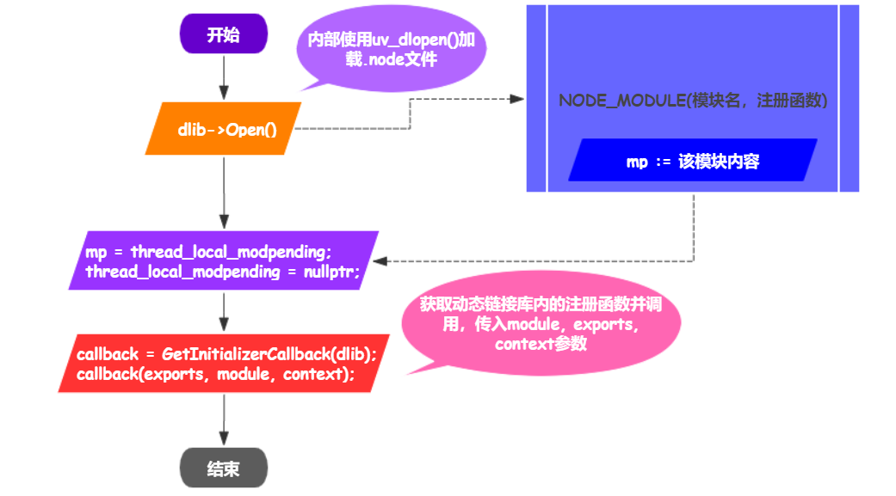

### 准备工作

终于到了实践环节，但别急，工欲善其事，必先利其器，先准备好开发环境。

#### 编辑器

通过对比Vim/Vs Code/Qt Creator/CLoin几款编辑器后，得到一个结论: Vim没有代码提示（太菜了，不会配），Vs Code写C++代码异常的卡，动不动代码提示、高亮就全没了。Qt Creator写C++很不错，但是转手写JavaScript时很头疼，最后还是选择CLoin，无论是C++还是JavaScript都支持的非常好(jetbrian大法好)，最重要的是提示不会写着写着就没了，只不过要稍微写写CmakeList.txt文件。

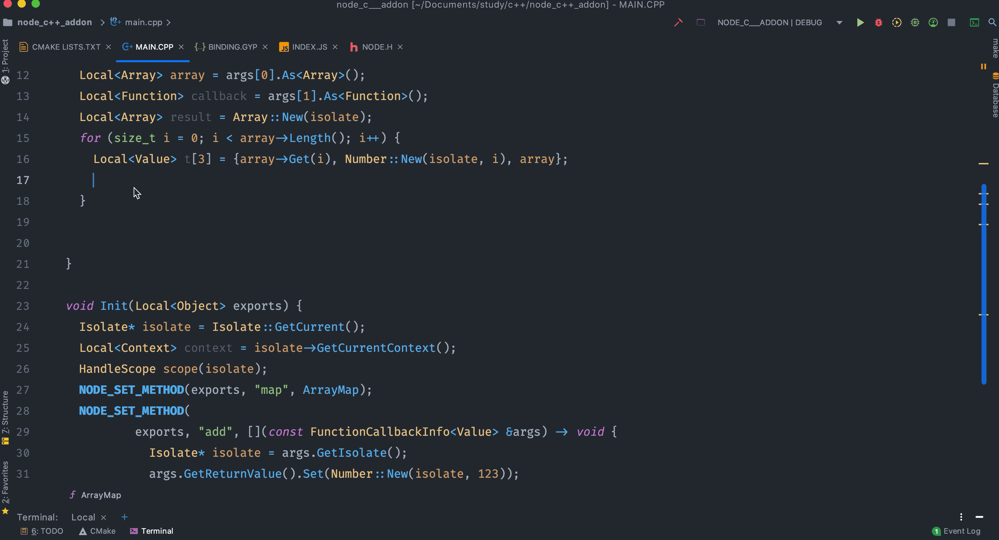

#### node-gyp

​	[node-gyp](https://github.com/Node.js/node-gyp)是Node.js下的扩展构建工具，在安装C++插件时，通过一个**binding.gyp**描述文件来生成不同系统所需要的C++项目文件(UNIX 的 Makefile，Windows下的Visual Studio项目)，然后调用相应的构建工具(gcc)来进行构建。

**安装**

mac 上保证安装了xcode(应用商店直接下载即可)，然后命令行

```bash
npm install node-gyp -g
```

node-gyp的常用命令

+ **help**
+ **configure** 根据平台和node版本，生成相应的构建文件(生成一个build目录)
+ **build** 构建node插件(根据build文件夹的内容，生成.node文件)
+ **clean** 清除build目录
+ **rebuild** 依次执行 clean、configure、build，可以方便的重新构建插件
+ **install** 安装对应版本的node 头文件，代码提示必备
+ **list** 列出当前安装的node头文件的版本
+ **remove** 删除安装的node头文件


**binding.gyp文件初窥**

上面提到了binding.gyp文件，其实它是一个类似于python的dict的一个文件，基于python的dict语法，注释风格也和python一致。比如一个简单的binding.gyp如下

```python
{
  "targets": [
    {
      "target_name": "addon",
      "sources": [
        "addon.cpp" # 编译用的c++源文件
      ],
    }
  ]
}
```

```targets```字段是一个数组，数组中每一个元素都是将要被node-gyp构建的C++模块，```target_name```是必须的，表示模块名，编译时会通过该名字来命名.node文件，```sources```字段也是必须的，用于将哪些文件当作源码进行编译。

1. **基本类型**

类似于python的数据类型，gyp里面的基本类型只有 String, Integer, Lists, Dictionaries

2. **关键字段**

下面列举一些比较常见的字段（键）

```targets```, ```target_name```,```sources```上面解释过了，这里就不解释了。

```include_dirs```: 头文件搜索路径，```-I```标识，比如```gcc -I some.c -o some.o```

```defines```: 为目标添加预编译宏，```-D```标识，比如```gcc -D N=1000 some.c -o some.i``` ，直接在源文件中添加```#define N 1000```

```libraries```: 为编译添加链接库，```-L```编译标识

```cflags```: 自定义编译标识

```dependencies```: 如果代码中用了第三方的C++代码，就需要在binding.gyp中将这个库编译为静态链接库，然后在主target使用```dependencies```将第三方库依赖进来。

```conditions```: 分支条件处理字段

```type```: 编译类型，有三种值：```shared_library```(动态链接库),```static_library```(静态链接库),```loadable_module```(Node.js可直接载入的C++扩展动态链接库, binding.gyp的默认类型)

```variables```: 变量字段，可以写一些变量在gyp文件中使用

下面是一个简单举个简单的例子，更多示例请参考: [https://github.com/Node.js/node-gyp/wiki/%22binding.gyp%22-files-out-in-the-wild](https://github.com/Node.js/node-gyp/wiki/"binding.gyp"-files-out-in-the-wild)

```python
{
  "targets": [
    {
    "target_name": "some_library",
    "sources": [
      "some.cc"
      ]
    },
    {
      "target_name": "main_addon",
      "variables": { # 定义变量
        "main": "main.cc",
        "include": ["./lib", "../src"]
      },
      "cflags": ["-Werror"] # g++编译标识
      "sources": [
        "<(main)" # 使用 < 这种方式引用变量
      ],
      "defines": [ # 定义宏
        "MY_NODE_ADDON=1"
      ],
      "include_dirs": [
        "/usr/local/node/include",
        "<@(include)" # 使用 <@ 引用数组变量
      ],
      "dependencies": [ # 定义依赖
        "some_library" # 依赖上面的some_library
      ],
      "libraries": [
        "some.a", # mac
        "xxx.lib" # win
      ],
      "conditions": [ # 条件，其格式如下
        [
          ["OS=='mac'", {"sources": ["mac_main.cc"]}], 
          ["OS=='win'", {"sources": ["win_main.cc"]}],
        ]
      ]
    }
  ]
}
```


3. **变量**

在gyp中主要有三类变量：**预定义变量**、**用户定义变量**，**自动变量**。

**预定义变量**：比如```OS```变量，表示当前的操作系统(linux, mac, win)

**用户定义变量**：在```variables```字段下定义的变量。

**自动变量**：所有的字符串键名都会被当作自动变量处理，变量名是键名加上_前缀。

**变量的引用**：以```<```开头或```>```开头，用```@```来区分不同类型的变量。```<(VAR)```或```>(VAR)```，如果```VAR```是一个字符串，则当作一个正常的字符串处理，如果```VAR```是一个数组，则按空格拼接数组每一项的字符串。```<@(VAR)```或```>@(VAR)```，该指令只能用在数组中，如果```VAR```是一个数组，数组的内容会一一插入到当前所在的数组中，如果是字符串则会按指定分隔符转成数组再一一插入到当前所在数组里。

4. **指令**

指令与变量类似，不过比变量高级一点，GYP读到指令时会启动一个进程去执行这条展开的指令，其语法格式是: 以```<!```开头或者```<!@```开头的，与变量相同的一点是```<!@```也是用于数组的。

```python
{
  # ...
  "include_dirs": [
    "<!(node -e \"require('nan')\")" # 相当于在cmd下执行 node -e "require('nan')"，并将结果放在include_dirs里
  ]
  # ...
}
```


5. **条件分支**

```conditions```字段，其值是一个数组，那么第一个元素是一个字符串，表示条件，条件格式跟python的条件分支一样，例如```"OS=='mac' or OS=='win'"```或者```"VAR>=1 and VAR <= 2"``` 。第二个元素则是一个对象，用于根据条件合并到最近的一个上下文中的内容。

6. **列表过滤器**

用于值是数组的键，键名以```!```或者```/```结尾，其中键名以```!```结尾是一个排除过滤器，表示这里的键值将被从无```!```的同名键中排除。键名以```/```结尾是一个匹配过滤器，表示通过正则匹配出相应结果，然后以指定方式（```include```或者```exclude```）进行处理。

```python
{
  "targets": [
    {
      "target_name": "addon",
      "sources": [
        "a.cc", "b.cc", "c.cc", "d.cc"
      ],
      "conditions": [
        ["OS=='mac'", {"sources!": ["a.cc"]}], # 排除过滤器，条件成立则从sources中排除掉a.cc
        ["OS=='win'", {"sources/": [ # 匹配过滤器
          ["include", "b|c\\.cc"], # 包含b.cc和c.cc
          ["exclude", "a\\.cc"] # 排除 a.cc
        ]}]
      ]
    }
  ]
}
```

7. **合并**

从上面可以看到GYP的许多操作都是通过字典和列表项合并在一起实现（条件分支），在合并操作时，最重要的是识别源和目标值之间的区别。

在合并一个字典时，遵循以下规则

+ 如果键在目标字典中不存在，则将其插入
+ 如果键已经存在
  + 如果值是字典，则源和目标值字典执行字典合并过程
  + 如果值是列表，则源和目标值列表执行列表合并过程
  + 如果值是字符串或整数，则直接将源值替换

在合并列表时，可根据附加到键名的后缀进行合并

+ 键以```=```结尾，源列表完全替换目标列表
+ 键以```?```结尾，则只有当键不在目标时，才会将源列表设置为目标列表
+ 键以```+```结尾，则源列表会被追加到目标列表
+ 键没有修饰符，则源列表内容附加到目标列表

例如

```python
# 源
{
  "include_dirs+": [
    "/public"
  ]
}
# 目标
{
  "include_dirs": [
    "/header"
  ],
  "sources": [
    "aa.cc"
  ]
}
# 合并后
{
  "include_dirs": [
    "/public",
    "/header"
  ],
  "sources": [
    "aa.cc"
  ]
}
```

### 第一个C++插件：Hello World

首先使用```node-gyp install```安装对应版本的Node.js头文件，安装完后头文件目录位于```~/.node-gyp/node-version/include/node```目录下， 或者在你的Node.js安装目录找到```include```目录，里面就是Node.js的头文件。

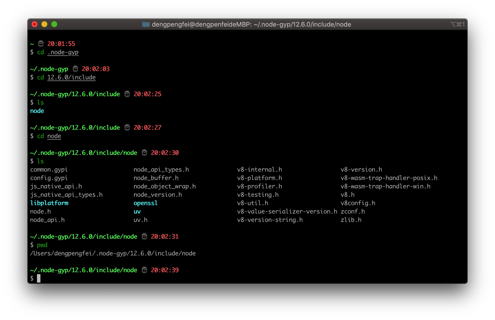

目录结构以及C++代码如下，首先使用```NODE_MODULE```宏去注册一个C++模块，对应的```Init```函数接受```Local<Object> exports```参数，这里的```exports```类似与Node.js中的```module.exports```，所以往```exports```挂载函数即可。	

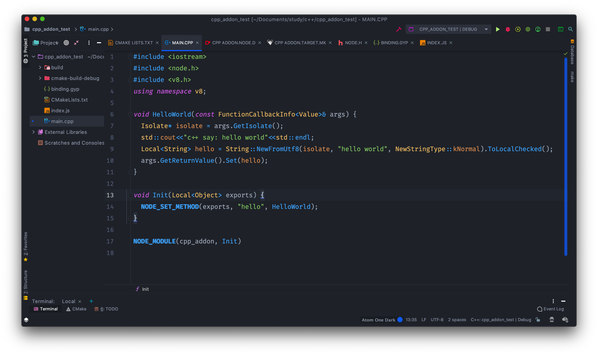

编写CMakeLists.txt，使用```include_directories```将node的头文件链接过来，编辑器代码提示时非常有用

```python
cmake_minimum_required(VERSION 3.15)
project(cpp_addon_test)

set(CMAKE_CXX_STANDARD 14)
# 链接node 头文件，代码提示时有用
include_directories(/Users/dengpengfei/.node-gyp/12.6.0/include/node) 

add_executable(cpp_addon_test main.cpp)
```

编写binding.gyp，将```sources```指定为```main.cpp```

```python
{
  "targets": [
    {
      "target_name": "cpp_addon",
      "sources": [
        "main.cpp"
      ]
    }
  ]
}
```

使用node-gyp对C++文件进行编译，使用```node-gyp configure```生成配置文件，```node-gyp build```构建C++插件（生成.node文件）。或者使用```node-gyp rebuild```直接构建C++插件。

index.js引入cpp_addon.node文件

```javascript
const cpp = require("./build/Release/cpp_addon");
console.log(cpp.hello());
```

运行结果如下

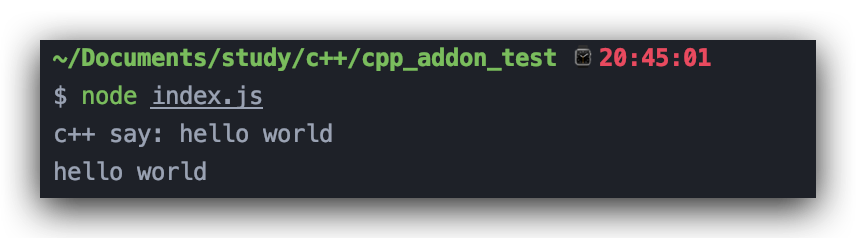

Hello world!不过瘾？那来看看几个简单的C++函数以及BigNumber类的封装吧。来看几个工具方法，```lib/utils.h```

```c++
int findSubStr(const char* str, const char* subStr); // 查找子串位置，kmp算法
int subStrCount(const char* str, const char* subStr); // 字串在源字符串中出现次数，kmp算法
```

以及BigNumber包装类，```lib/bigNumber.h```

```c++
class BigNumber: node::ObjectWrap {
  public:
    static void Init(Local<Object>); // Init函数
  private:
    explicit BigNumber(const char* value): value(value) {} // 构造函数
    ~BigNumber() override = default;
    static void New(const FunctionCallbackInfo<Value>&); // New
    static void Val(const FunctionCallbackInfo<Value>&); // 返回值
    static void Add(const FunctionCallbackInfo<Value>&); // 相加
    static void Multiply(const FunctionCallbackInfo<Value>&); // 相乘
    std::string value; // 用一个std::string 来存
};
```

这里使用了```node::ObjectWrap```封装类，将C++ Class与JavaScript Class相连接的工具类（位于 node_object_wrap.h头文件中，下文会具体介绍这个工具类）。由于篇幅有限，这里只展示函数以及类的定义，相关实现以及示例可以参考GitHub：https://github.com/sundial-dreams/node_cpp_addon

主函数```main.cpp```

```c++
#include <iostream>
#include <stdio.h>
#include <stdlib.h>
#include <node.h>
#include <node_object_wrap.h>
#include "lib/utils.h"
#include "lib/bigNumber.h"
const int N = 10000;
using namespace v8;
// 对findSubStr(const char*, const char*)的包装
void FindSubStr(const FunctionCallbackInfo<Value>& args) {
  Isolate* isolate = args.GetIsolate();
  if (!args[0]->IsString() || !args[1]->IsString()) {
    isolate->ThrowException(Exception::TypeError(ToLocalString("type error")));
  }
  // 将Local<String> 转化到 char*类型，下文会介绍
  String::Utf8Value str(isolate, args[0].As<String>());
  String::Utf8Value subStr(isolate, args[1].As<String>());
  int i = findSubStr(*str, *subStr);
  args.GetReturnValue().Set(Number::New(isolate, i));
}

// 对 subStrCount(const char*, const char*)的包装
void SubStrCount(const FunctionCallbackInfo<Value>& args) {
  Isolate* isolate = args.GetIsolate();
  if (!args[0]->IsString() || !args[1]->IsString()) {
    isolate->ThrowException(Exception::TypeError(ToLocalString("type error")));
  }
  // 将Local<String> 转化到 char*类型，下文会介绍
  String::Utf8Value str(isolate, args[0].As<String>());
  String::Utf8Value subStr(isolate, args[1].As<String>());
  int i = subStrCount(*str, *subStr); // 调用c++侧的方法
  args.GetReturnValue().Set(Number::New(isolate, i));
}

void Init(Local<Object> exports) {
  // 暴露出两个函数
  NODE_SET_METHOD(exports, "findSubStr", FindSubStr);
  NODE_SET_METHOD(exports, "subStrCount", SubStrCount);
  // 利用BigNumber的Init静态方法来暴露BigNumber类
  BigNumber::Init(exports);
}

NODE_MODULE(addon, Init)
```

binding.gyp文件如下

```python
{
  "targets": [
      {
          "target_name": "addon",
          "sources": [
              "lib/utils.cpp",
              "lib/bigNumber.cpp",
              "main.cpp"
          ]
      } 
  ]
}
```

就是将```lib/utils.cpp```，和```lib/bigNumber.cpp```都加入到```sources```里，使用```node-gyp rebuild```构建插件。

然后JavaScript侧

```javascript
const { findSubStr, subStrCount, BigNumber } = require("./build/Release/addon");
console.log("subStr index is: ", findSubStr("abcabdacac", "cab"));
console.log("subStr count is: ", subStrCount("abababcda", "ab"));

let n = new BigNumber("9999");
n.add(n);
console.log("add: ", n.val());
n.multiply("12222");
console.log("multiply: ", n.val());
```

运行一下

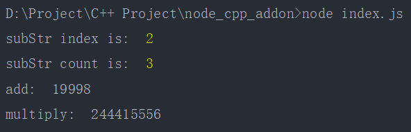

### 编写C++插件的几种方式

随着Node.js C++插件编写方式的变化， 本文总结出了以下几种编写C++插件的方式

1. **原生拓展**
2. **使用NAN**
3. **使用N-API**
4. **使用node-addon-api**

### 原生扩展

原生的方式是指直接使用内部的V8，libuv和Node.js库来创建插件，这种方式编写一个插件可能比较复杂，涉及到以下组件和API。

+ V8: JavaScript运行时，用于解释执行JavaScript。V8提供了创建对象，调用函数等机制。
+ libuv: 实现Node.js事件循环。
+ 内部Node.js库: Node.js本身会导出插件可以使用的C++API，比较重要的是```node::ObjectWrap```类。
+ Node.js其他静态链接库: 包括OpenSSL，zlib等，可以使用zlib.h，openssl等来在自己的插件中引用。

#### V8

V8（[v8文档](https://v8.dev/docs)）引擎是一个**可独立运行**的JavaScript运行时，回顾浏览器端和Node.js端的区别，大概就是对V8引擎的上层封装不一样，也就是说我们可以拿着V8引擎自己包装一个自己的Node.js。

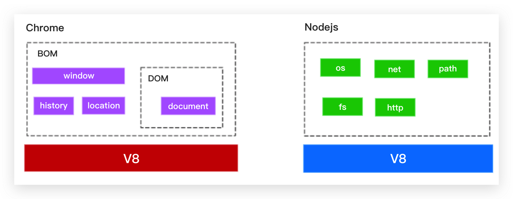

Node.js是V8引擎的一个宿主，其很大部分都是直接使用Chrome V8所暴露出来的API。

**V8的一些基本概念**

1. **Isolate**

+ 一个Isolate就是一个V8引擎实例，也称隔离实例(Isolated instance)，实例内部拥有完全独立的各种状态，包括堆管理，垃圾回收等。
+ Isolate通常传递给其他V8 API函数，并提供一些API来管理JavaScript引擎的行为或者查询一些相关信息，比如内存使用情况。

+ 一个Isolate生成的任何对象都不能在另一个Isolate中使用。
+ 在Node.js插件中Isolate可通过以下方式获取

```c++
// 直接获取
Isolate* isolate = Isolate::GetCurrent();
// 如果有Context
Isolate* isolate = context->GetIsolate(); 
// 在binding函数中有const FunctionCallback<Value>& args
Isolate* isolate = args.GetIsolate();
// 如果有Environment
Isolate* isolate = env->isolate();
```

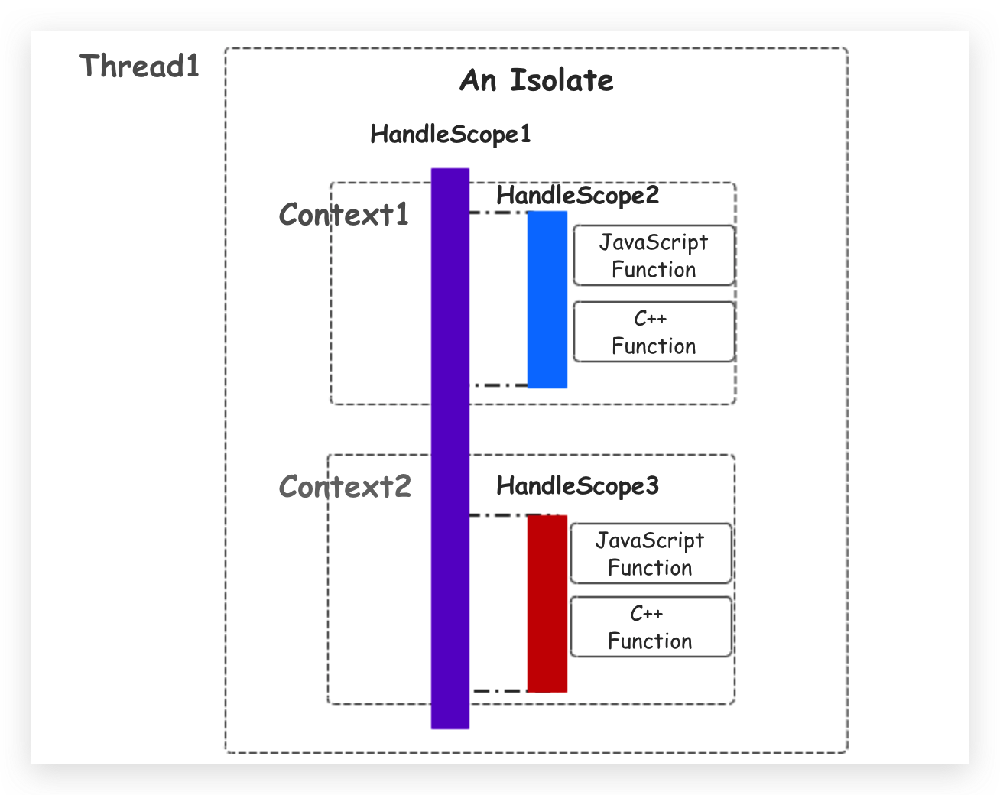

2. **Context**

可以理解为浏览器上的window，其实Node也有自己的context，即global，甚至我们也可以对context进行包装，比如

```javascript
Local<ObjectTemplate> global = ObjectTemplate::New(isolate);
Local<String> key = String::NewFromUtf8(isolate, "CONST", NewStringType::kNormal).ToLocalChecked();
Local<String> value = String::NewFromUtf8(isolate, "I am global value", NewStringType::kNormal).ToLocalChecked();
global->Set(key, value);
Local<Context> myContext = Context::New(isolate, nullptr, global); // 使用这种方式创建Context，然后现在的Context就是 { CONST: "I am global value" }
```

3. **Script**

就是一个包含一段已经编译好的JavaScript脚本对象，数据类型是```Script```，并且在编译时与一个```Context```进行绑定。我们可以实现一个```eval```函数，将一段JavaScript代码进行编译，并且封装一个自己的```Context```，来看C++代码

```c++
#include <node.h>
#include <iostream>
using namespace v8;
// 这块的代码并不复杂
void Eval(const FunctionCallbackInfo<Value>& args) {
  Isolate* isolate = args.GetIsolate(); // 拿到 isolate
  HandleScope handleScope(isolate); // 定义句柄作用域
  Local<Context> context = isolate->GetCurrentContext(); // 拿到Context

  // 定义一个global对象并为他设置相应的键和值
  Local<ObjectTemplate> global = ObjectTemplate::New(isolate);
  Local<String> key = String::NewFromUtf8(isolate, "CONST", NewStringType::kNormal).ToLocalChecked();
  Local<String> value = String::NewFromUtf8(isolate, "I am global value", NewStringType::kNormal).ToLocalChecked();
  global->Set(key, value);
  Local<String> printStr = String::NewFromUtf8(isolate, "print", NewStringType::kNormal).ToLocalChecked(); // let printStr = "print";

  global->Set(printStr, FunctionTemplate::New(isolate, [](const FunctionCallbackInfo<Value>& args) -> void {
    Isolate* isolate = args.GetIsolate();
    for (size_t i = 0; i < args.Length(); i++) {
      Local<String> str = args[i].As<String>();
      String::Utf8Value s(isolate, str); // 数据转换，将Local转到char*，以便用cout输出 
      std::cout<<*s<<" ";
    }
    std::cout<<std::endl;
  }));
  /*
   global = {
     CONST: "I am global value"
     print: function(...args) {
       for(let i = 0; i < args.length; i++)
           console.log(args[i])
     }
   }
   */
  // 将global绑到自己的context上
  Local<Context> myContext = Context::New(isolate, nullptr, global);
  Local<String> code = args[0].As<String>();
  // 编译JavaScript代码
  Local<Script> script = Script::Compile(myContext, code).ToLocalChecked(); // 与myContext上下文进行绑定
  // 运行并将结果返回
  args.GetReturnValue().Set(script->Run(context).ToLocalChecked());
}

void Init(Local<Object> exports) {
  NODE_SET_METHOD(exports, "eval", Eval);
}

NODE_MODULE(addon, Init)
```

C++的逻辑其实非常简单，用```Local<ObjectTemplate> global = ObjectTemplate::New(isolate);```来产生一个空对象，并且在其上挂载了```CONST```常量和```print```函数，然后使用```Local<Context> myContext = Context::New(isolate, nullptr, global);```将global绑在一个Context上。```Script::Compile(myContext, code)```编译JavaScript代码并将运行结果返回回去```args.GetReturnValue().Set(script->Run(context).ToLocalChecked());```。这里涉及到的```Local```，```FunctionCallbackInfo```，```HandleScope```以及一些数据类型下面将做解释

用```node-gyp rebuild```或者```node-gyp clean && node-gyp configure && node-gyp build```进行编译生成.node文件

再来看JavaScript侧，加载.node文件

```javascript
const cpp = require("./build/Release/addon");
const code = `
  let arr = ["hello", "world"];
  print(CONST); // 这个print函数以及CONST就是我们绑到global上的函数和常量 
  for(let v of arr) {
    print(v);
  }
`;
console.log(cpp.eval(code));
```

运行JavaScript

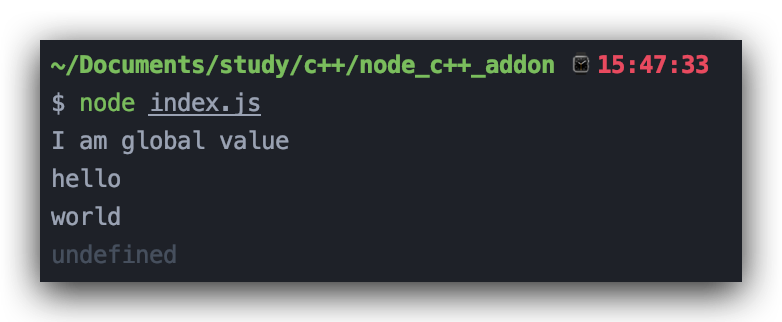

4. **Handle**

即句柄，它是V8中的一个重要概念，提供对堆内存中JavaScript数据对象的一个引用。当一个对象不再被句柄所引用时，那么它将被认为是垃圾，V8的垃圾收集机制会不时的对其进行回收。

> 在window中，句柄是用来标识别应用程序所建立或使用的对象的唯一整数（编号），可以理解为标识符，用来标识对象或者项目。

在V8中，句柄有以下几种(**句柄的存在形式是一个C++模板类，根据不同的V8数据类型进行不同的声明**)

+ ```Local```: 本地句柄，在编写C++扩展是最常用的句柄，它存在于栈内存中，并在对应的析构函数被调用时删除，它们的生命周期由其所在的句柄作用域（HandleScope）决定。大多数时候可以通过JavaScript数据类的一些静态方法来获取一个```Local```句柄

```javascript
HandleScope handleScope(isolate);
Local<Number> n = Number::New(isolate, 22);
Local<String> str = String::NewFromUtf8(isolate, "fff");
Local<Function> func = Function::New(context, Eval).ToLocalChecked();
Local<Array> arr = Array::New(isolate, 20);
```

使用```handle.Clear()```清除一个句柄（类似于指针指向“空”），使用```handle.IsEmpty()```判断当前句柄是否为空，使用```As()/Cast()```函数进行句柄类型转换

```c++
Local<String> str = Local<String>::Cast(handle); // 使用Cast
Local<String> str1 = handle.As<String>(); // 使用As
```


+ ```MaybeLocal```: 有时候需要在句柄使用的地方用```handle.IsEmpty()```来判断是否为空，类似于判断是否为空指针，但在每一个句柄使用的地方都加这种判断的话就有点增加代码量以及系统复杂度了，因此```MaybeLocal```就诞生了，那些有可能返回空```Local```句柄的接口都使用```MaybeLocal```去替代，而如果想获得正真的```Local```句柄的话，就得用```ToLocalChecked()```

```c++
MaybeLocal<String> s = String::NewFromUtf8(isolate, "sss", NewStringType::kNormal);
Local<String> str = s.ToLocalChecked();
double a = args[0]->ToNumber(context).ToLocalChecked();

// 或者使用ToLocal方法，如果句柄不为空，则返回true，并把值给out
Local<String> out;
if (s.ToLocal(&out)) {
  // 
} else {
  // 
}
```

+ ```Persistent/Global```: 持久句柄，提供在堆内存声明JavaScript对象的引用（比如浏览器的DOM），因此持久句柄和```Local```本地句柄在生命周期的管理上是两种不同的方式。持久句柄可以使用```SetWeak```来变为弱持久句柄，当堆中的JavaScript对象的引用只剩一个弱持久句柄时，V8的垃圾回收器就会触发一个回调。

```c++
Local<String> str = String::NewFromUtf8(isolate, "fff", NewStringType::kNormal).ToLocalChecked();
Global<String> gStr(isolate, str); // 根据Local句柄构造一个持久句柄
```

与其他句柄一样，持久句柄依然可以用```Clear()```清除，```IsEmpty()```判断是否为空。

```Reset```重新设置句柄引用,```Get```获得当前句柄引用

```C++
Local<String> str1 = String::NewFromUtf8(isolate, "yyy", NewStringType::kNormal).ToLocalChecked();
gStr.Reset(isolate, str1); //重设句柄
  
Local<String> r = gStr.Get(isolate);
```

```SetWeak```设为弱持久句柄，其函数原型如下

```c++
void PersistentBase<T>::SetWeak(
  P* parameter, typename WeakCallbackInfo<P>::Callback callback,
  WeakCallbackType type) 
```

其中```parameter```时任意数据类型，```callback```是当一个JavaScript对象的引用只剩一个弱持久句柄时触发的一个回调，```type```是一个枚举值，取值有```kParameter```和 ```kInternalFields```和```kFinalizer```

```c++
int* p = new int;
// gStr快被回收时，则将p对象传到回调函数中去，并且在回调中通过data.GetParameter()来获取p
gStr.SetWeak(p, [](const WeakCallbackInfo<int> &data) -> void {
    int* p = data.GetParameter();
    delete p;
}, WeakCallbackType::kParameter);
```

```ClearWeak```是用于取消弱持久句柄，将其变为持久句柄，```IsWeak```用于判断是否为弱持久句柄。

+ ```Eternal```: 永生句柄，这种句柄在程序的整个生命周期中都不会被删除，也由于这个特性，它比持久句柄开销更小。

5. **HandleScope**

句柄作用域，一个维护句柄的容器，当一个句柄作用域对象的析构函数被调用时（对象被销毁时），在这个作用域中创建的句柄都会被从栈中抹去，失去所有引用，然后被垃圾回收器处理。句柄作用域有两种```HandleScope```和```EscapableHandleScope```

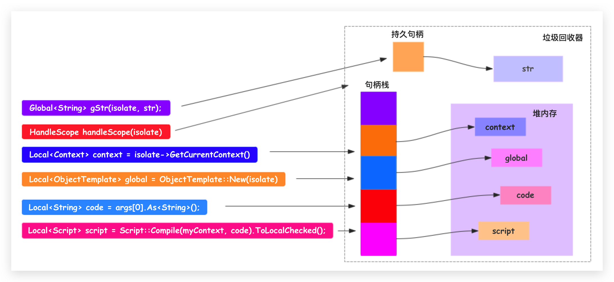


+ ```HandleScope```: 一般句柄作用域，使用```HandleScope handleScope(isolate)```来在当前作用域下声明句柄作用域，根据C++的语法，当```handleScope```所在的作用域结束时（比如函数执行完）就会调用它的析构函数来做一些收尾操作。

```c++
void Add(const FunctionCallbackInfo<Value>& args) {
  Isolate* isolate = args.GetIsolate();
  HandleScope handleScope(isolate); // 定义一个句柄作用域
  // 一堆Local句柄
  Local<Number> a = args[0].As<Number>();
  Local<Number> b = args[1].As<Number>();
  double r = a->Value() + b->Value();
  Local<Number> result = Number::New(isolate, r);
  args.GetReturnValue().Set(result);

  return; // 当前作用域终结，则调用handleScope的析构函数，从栈中删除句柄a, b, result
}
```

+ ```EscapableHandleScope```: 可逃句柄作用域，顾名思义，让一个句柄逃离当前作用域，举个例子

```c++
Local<Number> getValue() {
  Isolate* isolate = Isolate::GetCurrent();
  HandleScope handleScope(isolate);
  Local<Number> result = Number::New(isolate, 12);
  return result;
}
```

上面的函数感觉没什么问题，但实际上，这存在一个巨坑，按照上面讲的，```handleScope```在当前作用域结束时调用析构函数将在当前作用域的句柄```result```全给删除掉，而其引用的数值实体失去引用则被标记为垃圾，然后又在外面使用，则会出问题，因此使用```EscapableHandleScope```改造上面的函数

```c++
Local<Number> getValue() {
  Isolate* isolate = Isolate::GetCurrent();
//  HandleScope handleScope(isolate);
  EscapableHandleScope scope(isolate);
  Local<Number> result = Number::New(isolate, 12);
  return scope.Escape(result); // 将result逃离当前作用域
}
```

6. **V8 JavaScript Value** 

V8对JavaScript中的每一种数据类型都有C++层面的封装，比如```Number```, ```String```, ```Object```, ```Function```, ```Boolean```, ```Date```, ```Promise```等等，这些数据类型都由```Value```派生而来

下面列举几个类型的例子

+ ```Value```

所有数据类型的父类，或者说是所有数据类型的抽象。它有两个比较重要的API，```Is...```, ```To...```。```Is...```判断是哪种类型，例如```args[0].IsNumber()```，```args[0].IsFunction()```等，```To...```转化为某种类型```args.ToNumber(context)```,返回一个```MayBeLocal```句柄。

+ ```Number```

数值类型，该类型比较简单，通过```Number::New(isolate, 222)```可以创建一个数值对象句柄，```number->Value()```获得具体的值，返回是一个```double```。

+ ```String```

```String```是比较常用的数据类型，使用```String::NewFromUtf8(isolate, "fff", NewStringType::kNormal)```可以构造一个字符串句柄，返回是一个```MaybeLocal```句柄。

每次创建一个String句柄都需要写一长串代码，所以封装了一个```ToLocalString```函数

```c++
Local<String> ToLocalString(const char* str) {
  Isolate* isolate = Isolate::GetCurrent();
  EscapableHandleScope scope(isolate);
  Local<String> result = String::NewFromUtf8(isolate, str, NewStringType::kNormal).ToLocalChecked();
  return scope.Escape(result);
}
```

在许多情况下，我们需要将```String```转化为C++的```char*```类型，这个时候可以借助```String::Utf8Value```

```c++
Local<String> str = String::NewFromUtf8(isolate, "hello world", NewStringType::kNormal).ToLocalChecked();
String::Utf8Value value(isolate, str);
std::cout<<value.length()<<std::endl;
const char* cppStr = *value; // *value可以转化为char* 或const char* 类型
std::cout<<cppStr<<std::endl;
```

和上面一样，将转化为原生字符串封装成一个函数```ToCString```

```c++
char* ToCString(Local<String> from) {
  Isolate* isolate = Isolate::GetCurrent();
  String::Utf8Value v(isolate, from);
  return *v;
}
```

+ ```Function```

函数也是对象的一种，所以它继承自```Object```类，对于一个函数类型，可以用```Call()```来调用函数，```NewInstance()```以```new```的方式调用函数，以及```setName()/getName()```来设置函数名。

```Call```: 该函数原型如下

```c++
MaybeLocal<Value> Call(Local<Context> context,Local<Value> recv, int argc, Local<Value> argv[]);
```

```context```为上下文句柄对象，```recv```可以理解为绑定```this```的指向，可以传一个```Null(isolate)```进去，类似于JavaScript中的```call```的第一个参数，```argc```为函数参数个数，```argv```是一个数组，表示传入到函数里的参数

例子，用C++实现```filter```函数

```c++
#include <iostream>
#include <node.h>

using namespace v8;

// to Local<String>
Local<String> ToLocalString(const char* str) {
  Isolate* isolate = Isolate::GetCurrent();
  EscapableHandleScope scope(isolate);
  Local<String> result = String::NewFromUtf8(isolate, str, NewStringType::kNormal).ToLocalChecked();
  return scope.Escape(result);
}

void Filter(const FunctionCallbackInfo<Value>& args) {
  Isolate* isolate = args.GetIsolate();
  HandleScope scope(isolate);
  Local<Context> context = isolate->GetCurrentContext();
  if (!args[0]->IsArray() && !args[1]->IsArray()) {
    isolate->ThrowException(Exception::TypeError(ToLocalString("Type error")));
    return;
  }
  Local<Array> array = args[0].As<Array>();
  Local<Function> fn = args[1].As<Function>();
  Local<Array> result = Array::New(isolate);
  Local<Value> fnArgs[3] = { Local<Value>(), Number::New(isolate, 0), array };
  for (uint32_t i = 0, j = 0; i < array->Length(); i++) {
    fnArgs[0] = array->Get(context, i).ToLocalChecked(); // v
    fnArgs[1] = Number::New(isolate, i); // i
    Local<Value> v = fn->Call(context, Null(isolate), 3, fnArgs).ToLocalChecked();
    if (v->IsTrue()) { // get return
      result->Set(context, j++, fnArgs[0]).FromJust();
    }
  }
  args.GetReturnValue().Set(result);
}

void Init(Local<Object> exports) {
  NODE_SET_METHOD(exports, "filter", Filter);
}

NODE_MODULE(addon, Init)

```

+ ```Array```

数组对象比较简单，比较常用的就是```Array::New(isolate)```来创建数组，```Set()/Get()```来对数组进行操作，```Length()```获取数组长度。参考上面的```filter```函数

+ ```Object```

对象类型，很多类型，比如```Function```，```Array```都是继承自```Object```，使用```Object::New(isolate)```可以创建一个对象句柄，通过```Set()```，```Get()```， ```Delete()```来对键进行操作

```c++
void CreateObject(const FunctionCallbackInfo<Value>& args) { // return { name, age }
  Isolate* isolate = args.GetIsolate();
  HandleScope handleScope(isolate);
  Local<Context> context = isolate->GetCurrentContext();

  Local<Object> object = Object::New(isolate);
  Local<String> nameKey = String::NewFromUtf8(isolate, "name", NewStringType::kNormal).ToLocalChecked();
  Local<String> ageKey = String::NewFromUtf8(isolate, "age", NewStringType::kNormal).ToLocalChecked();
  Local<String> nameValue = args[0].As<String>();
  Local<Number> ageValue = args[1].As<Number>();

  object->Set(context, nameKey, nameValue).Check(); // 设置键
  object->Set(context, ageKey, ageValue).Check(); // 设置键
  args.GetReturnValue().Set(object);
}
```

7. **FunctionCallbackInfo**

函数回调信息，包含一个JavaScript函数调用所需的各种信息(参数，this等)，例如

```c++
void Add(const FunctionCallbackInfo<Value>& args) {
  
}
```

在使用```args```时

+ 通过```Length()```来获取传入的参数个数
+ 通过```args[i]```来获取第i个参数
+ 通过```args.This()```来得到函数的```this```
+ 通过```args.Holder()```得到函数调用时的```this```，使用```call```, ```bind```,``` apply```可以改变```this```指向
+ 通过```args.IsConstructCall()```来判断是否为构造函数调用，即是否用```new```调用
+ 通过```args.GetIsolate()```获得当前的```Isolate```
+ 通过```args.GetReturnValue()```来获取存储返回值的对象，并且设置返回值，即使用```Set()```方法，可以用```SetNull()```来返回一个```null```，```SetUndefined()```返回一个```undefined```，```SetEmptyString()```来返回一本空字符串。


8. **Template**

模版，即JavaScript对象和函数的一个模具，用来把C++函数或者数据结构包裹进JavaScript对象中。这里介绍两种模板：函数模板```FunctionTemplate``` 和对象模板```ObjectTemplate```。

+ ```FunctionTemplate```

顾名思义，用于包裹C++函数的模具，当生成一个函数模板后可以调用```GetFunction```来获取其实体句柄，并且JavaScript侧能直接调用这个函数。回顾```NODE_SET_METHOD```宏，```NODE_SET_METHOD(exports, "eval", Eval);```将Eval函数包裹，并且JavaScript侧能够调用，可以翻开它的实现

```c++
inline void NODE_SET_METHOD(v8::Local<v8::Object> recv,
                            const char* name,   
                            v8::FunctionCallback callback) { // 内联函数
  v8::Isolate* isolate = v8::Isolate::GetCurrent();
  v8::HandleScope handle_scope(isolate);
  v8::Local<v8::Context> context = isolate->GetCurrentContext();
  // 生成一个函数模板
  v8::Local<v8::FunctionTemplate> t = v8::FunctionTemplate::New(isolate,
                                                                callback);
  // GetFunction获得句柄实例，返回是一个MayBeLocal
  v8::Local<v8::Function> fn = t->GetFunction(context).ToLocalChecked();
  v8::Local<v8::String> fn_name = v8::String::NewFromUtf8(isolate, name,
      v8::NewStringType::kInternalized).ToLocalChecked();
  // 设置函数名
  fn->SetName(fn_name);
  recv->Set(context, fn_name, fn).Check();
}
#define NODE_SET_METHOD node::NODE_SET_METHOD
```

```callback```是一个```typedef void (*FunctionCallback)(const FunctionCallbackInfo<Value>& info);```类型的函数指针，例如```void Method(const FunctionCallbackInfo<Value>& args) {}```，

+ ```ObjectTemplate```: 对象模板用于在运行时创建对象。例如下面这个

```c++
Local<ObjectTemplate> global = ObjectTemplate::New(isolate);
```

对象模板有两个常见用途，**当一个函数模板被用作一个构造函数时，该对象模板就用来配置创建出来的对象**（说白了就是JavaScript中的构造函数实现类），例如下面的JavaScript类

```javascript
function Person(name, age) {
    this._name = name;
    this._age = age;
}
Person.prototype.getName = function () {
    return this._name;
};
Person.prototype.getAge = function () {
    return this._age;
};
```

在C++中的实现就是

```c++
#include <iostream>
#include <node.h>
using namespace v8;
// return Local<String>
Local<String> ToLocalString(const char* str) { 
  Isolate* isolate = Isolate::GetCurrent();
  EscapableHandleScope scope(isolate); // EscapableHandleScope派上用场了
  Local<String> key = String::NewFromUtf8(isolate, str, NewStringType::kNormal).ToLocalChecked();
  return scope.Escape(key);
}

// Person构造函数
void Person(const FunctionCallbackInfo<Value>& args) {
  Isolate* isolate = args.GetIsolate();
  HandleScope handleScope(isolate);
  Local<Context> context = isolate->GetCurrentContext();
  Local<Object> self = args.This(); // 相当与js函数里面的this

  Local<String> nameKey = ToLocalString("name");
  Local<String> nameValue = args[0].As<String>();

  Local<String> ageKey = ToLocalString("age");
  Local<Number> ageValue = args[1].As<Number>();
  self->Set(context, nameKey, nameValue).Check();
  self->Set(context, ageKey, ageValue).Check();
  args.GetReturnValue().Set(self);
}
void GetName(const FunctionCallbackInfo<Value>& args) {
  Isolate* isolate = args.GetIsolate();
  HandleScope handleScope(isolate);
  Local<Context> context = isolate->GetCurrentContext();

  args.GetReturnValue().Set(args.This()->Get(context, ToLocalString("name")).ToLocalChecked());
}
void GetAge(const FunctionCallbackInfo<Value>& args) {
  Isolate* isolate = args.GetIsolate();
  HandleScope handleScope(isolate);
  Local<Context> context = isolate->GetCurrentContext();
  args.GetReturnValue().Set(args.This()->Get(context ,ToLocalString("age")).ToLocalChecked());
}

void Init(Local<Object> exports) {
  Isolate* isolate = Isolate::GetCurrent();
  Local<Context> context = isolate->GetCurrentContext();
  HandleScope handleScope(isolate);
  // 定义一个函数模板
  Local<FunctionTemplate> person = FunctionTemplate::New(isolate, Person);
  // 设置类名
  person->SetClassName(ToLocalString("Person"));
  // 拿到函数模板的原型对象
  Local<ObjectTemplate> prototype = person->PrototypeTemplate();
  // 为这个对象设置值
  prototype->Set(ToLocalString("getName"), FunctionTemplate::New(isolate, GetName));
  prototype->Set(ToLocalString("getAge"), FunctionTemplate::New(isolate, GetAge));

  exports->Set(context, ToLocalString("Person"), person->GetFunction(context).ToLocalChecked()).Check();
}

NODE_MODULE(addon, Init)
```

```node-gyp rebuild```编译插件，然后JavaScript侧调用

```javascript
const cpp = require("./build/Release/addon");
const person = new cpp.Person("sundial-dreams", 21);
console.log(person.getName());
console.log(person.getAge());
```

运行效果

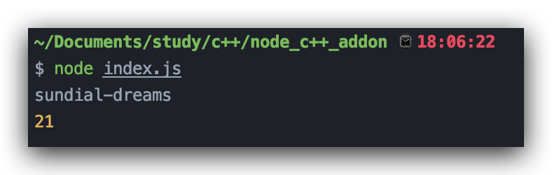

第二个用法就是，**用对象模板创建对象**，例如实现下面创建对象的JavaScript函数

```javascript
function createObject(name, age) {
    return { name, age }
}
```

在C++侧的实现就是（使用对象模板）

```c++
void CreateObject(const FunctionCallbackInfo<Value>& args) {
  Isolate* isolate = args.GetIsolate();
  HandleScope handleScope(isolate);
  Local<Context> context = isolate->GetCurrentContext();
  Local<ObjectTemplate> obj = ObjectTemplate::New(isolate); // 利用对象模板创建空对象
  obj->Set(ToLocalString("name"), args[0].As<String>());
  obj->Set(ToLocalString("age"), args[1].As<Number>());
  args.GetReturnValue().Set(obj->NewInstance(context).ToLocalChecked()); // 实例化这个对象
}
```


9. **Internal fields**

内置字段，将C++层面的数据结构与V8的数据类型建立一个联系，该字段对于JavaScript代码来说是不可见的，只能通过```Object```的特定方法获取（可以理解为私有属性）。在```ObjectTemplate```里

+ 通过```objectTemplate->SetInternalFieldCount(1)```来设置内置字段的个数
+ 通过```objectTemplate->InternalFieldCount()```来获取内置字段的个数
+ 通过```ObjectTemplate```的实例
  + ```object->SetInternalField(0, vaule);```来设置内置字段值，其中value是一个```External```类型的句柄，包裹任意类型指针
  + 对应的```object->GetInternalField(0);```来获取对应内置字段的值
  + ```object->SetAlignedPointerInInternalField(0, p);```设置内置字段值，只不过第二个参数```p```直接就是任意类型指针
  + 对应的```object->GetAlignedPointerFromInternalField(0); ```来获取设置的字段值，返回是一个```void*```指针

我们可以上面的```Person```进行一个改造，将```name```和```age```藏在```InternalFileds```里

```c++
#include <iostream>
#include <node.h>
using namespace v8;
// to Local<String>
Local<String> ToLocalString(const char* str) {
  Isolate* isolate = Isolate::GetCurrent();
  EscapableHandleScope scope(isolate);
  Local<String> result = String::NewFromUtf8(isolate, str, NewStringType::kNormal).ToLocalChecked();
  return scope.Escape(result);
}

// 内置字段
struct person {
  person(const char* name, int age): name(name), age(age) {}
  std::string name;
  int age;
};

void GetAll(const FunctionCallbackInfo<Value>& args) {
  Isolate* isolate = args.GetIsolate();
  HandleScope handleScope(isolate);
  Local<Object> self = args.Holder(); // 获取运行时的this
  Local<External> wrapper = Local<External>::Cast(self->GetInternalField(0)); // 或者self->GetInternalField(0).As<External>();
  auto p = static_cast<person*>(wrapper->Value()); // Value() 返回的是void* 类型

  char result[1024];
  sprintf(result, "{ name: %s, age: %d }", p->name.c_str(), p->age);
  args.GetReturnValue().Set(ToLocalString(result));
}
// { getAll() { return `{ name: ${name}, age: ${age} }` } }
void CreateObject(const FunctionCallbackInfo<Value>& args) {
  Isolate* isolate = args.GetIsolate();
  HandleScope handleScope(isolate);
  Local<Context> context = isolate->GetCurrentContext();

  Local<ObjectTemplate> objectTemplate = ObjectTemplate::New(isolate);
  objectTemplate->SetInternalFieldCount(1); // 设置内置字段数量
  Local<Object> object = objectTemplate->NewInstance(context).ToLocalChecked();

  Local<String> name = args[0].As<String>();
  Local<Number> age = args[1].As<Number>();
  String::Utf8Value nameValue(isolate, name); // 可以使用 *nameValue 转化为 char* 类型
  auto p = new person(*nameValue, int(age->Value())); // 塞到内置字段里的person指针
  
  object->SetInternalField(0, External::New(isolate, p)); // 使用External数据类型包装person指针，其中New的第二个参数是void* 指针
  Local<Function> getAll = FunctionTemplate::New(isolate, GetAll)->GetFunction(context).ToLocalChecked(); // GetAll函数来获取内置字段的值
  object->Set(context, ToLocalString("getAll"), getAll).Check();
  args.GetReturnValue().Set(object);
}

void Init(Local<Object> exports) {
  NODE_SET_METHOD(exports, "createObject", CreateObject);
}

NODE_MODULE(addon, Init)

```

```node-gyp rebuild```构建插件

```javascript
const cpp = require("./build/Release/addon");
const person = cpp.createObject("sundial-dreams", 21);
console.log(person);
console.log(person.getAll());
```

执行

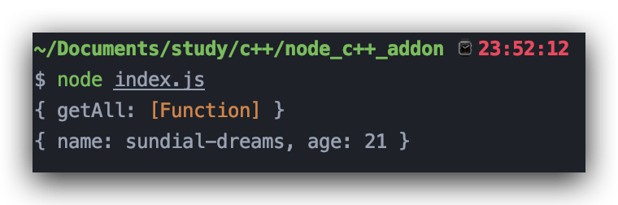


#### node::ObjectWrap

即使用C++封装一个JavaScript类，虽然上面介绍了JavaScript类的封装，但其实都是基于JavaScript的语言特性（构造函数、原型链等）。而C++是一门面向对象的语言，如果不能使用C++ class 那有什么用呢。因此Node.js提供了```ObjectWrap```类（位于node_object_wrap.h头文件下）来帮助我们使用C++ class来创建JavaScript class。例子中的BigNumber也是用这种方式编写的。

+ ```vodi Wrap(Local<Object> handle)```: 将传入的```Object```本地句柄弄成一个与当前```ObjectWrap```对象关联的对象，即设置内置字段
+ ```static T* Unwrap(Local<Object> handle)```: 从```Object```本地句柄中获取与之关联的```ObjectWrap```对象

基于```node::ObjectWrap```，我们重新实现```Person```类

```c++
#include <iostream>
#include <string>
#include <node.h>
#include <node_object_wrap.h>

using namespace v8;
// to Local<String>
Local<String> ToLocalString(const char* str) {
  Isolate* isolate = Isolate::GetCurrent();
  EscapableHandleScope scope(isolate);
  Local<String> result = String::NewFromUtf8(isolate, str, NewStringType::kNormal).ToLocalChecked();
  return scope.Escape(result);
}

// Person Class
class Person : public node::ObjectWrap {
  public:
    static void Init(Local<Object>);

  private:
    explicit Person(const char* name, int age) : name(name), age(age) { };

    ~Person() override = default; // 利用父类的析构函数来做收尾操作

    static void New(const FunctionCallbackInfo<Value> &);

    static void GetName(const FunctionCallbackInfo<Value> &);

    static void GetAge(const FunctionCallbackInfo<Value> &);

    std::string name;

    int age;
};

// 依然是借助ObjectTemplate和FunctionTemplate来创建Class
void Person::Init(Local<class v8::Object> exports) {
  Isolate* isolate = exports->GetIsolate();
  Local<Context> context = isolate->GetCurrentContext();
  Local<ObjectTemplate> dataTemplate = ObjectTemplate::New(isolate);
  dataTemplate->SetInternalFieldCount(1); // 预留1个内置字段，用来保存Person指针
  Local<Object> data = dataTemplate->NewInstance(context).ToLocalChecked();
  // 第三个参数是传入到New函数的参数args的Data()信息，可以通过args.Data()拿到data的值
  Local<FunctionTemplate> fnTemplate = FunctionTemplate::New(isolate, New, data); // Person::New方法
  fnTemplate->SetClassName(ToLocalString("Person"));
  fnTemplate->InstanceTemplate()->SetInternalFieldCount(1);
  // 使用这个宏，设置原型函数
  NODE_SET_PROTOTYPE_METHOD(fnTemplate, "getName", GetName);
  NODE_SET_PROTOTYPE_METHOD(fnTemplate, "getAge", GetAge);

  Local<Function> constructor = fnTemplate->GetFunction(context).ToLocalChecked();
  // 将 constructor ，Person类的构造函数设置到data的内置字段里
  data->SetInternalField(0, constructor);
  exports->Set(context, ToLocalString("Person"), constructor).FromJust();
}
// 正真的构造函数
void Person::New(const FunctionCallbackInfo<Value> &args) {
  Isolate* isolate = args.GetIsolate();
  Local<Context> context = isolate->GetCurrentContext();
  // 通过 new Person("aa", 21)调用
  if (args.IsConstructCall()) {
    Local<String> t = args[0].As<String>();
    String::Utf8Value name(isolate, t);
    int age = int(args[1].As<Number>()->Value());
    auto person = new Person(*name, age);
    // 这里是关键，将一个args.This()与person指针关联，person存储在args.This()的内置字段里，这也是上面要设置内置字段的原因
    person->Wrap(args.This());
    args.GetReturnValue().Set(args.This());
  } else { // 通过 Person("aa", 21)调用
    const int argc = 2;
    Local<Value> argv[argc] = {args[0], args[1]};
    // args.Data()是Init函数的data，从内置字段里拿到Person的构造函数（这个在Init函数里设置了）
    Local<Function> constructor = args.Data().As<Object>()->GetInternalField(0).As<Function>();
    Local<Object> result = constructor->NewInstance(context, argc, argv).ToLocalChecked();
    args.GetReturnValue().Set(result);
  }
}

void Person::GetName(const FunctionCallbackInfo<Value> &args) {
  Isolate* isolate = args.GetIsolate();
  HandleScope handleScope(isolate);
  // 这里是重点，利用Unwrap函数获取绑在args.This() / args.Holder()的person指针
  auto person = node::ObjectWrap::Unwrap<Person>(args.Holder());

  args.GetReturnValue().Set(ToLocalString(person->name.c_str()));
}

void Person::GetAge(const FunctionCallbackInfo<Value> &args) {
  Isolate* isolate = args.GetIsolate();
  HandleScope handleScope(isolate);

  auto person = node::ObjectWrap::Unwrap<Person>(args.Holder());

  args.GetReturnValue().Set(Number::New(isolate, person->age));
}


void Init(Local<Object> exports) {
  Person::Init(exports);
}

NODE_MODULE(addon, Init)
```

总结一下，其实使用```node::ObjectWrap```的方式就是将函数原型链模板与对象内置字段相结合了起来，将C++侧的数据结构封装成私有，暴露出一些通用方法给JavaScript侧，在给函数模版设置原型对象时直接用了```NODE_SET_PROTOTYPE_METHOD```宏，这个宏其实对之前提到的设置函数原型的一个封装。整个对象的封装过程其实就是对```args.This()```与当前的类的指针(```Person```)建立一个联系，有了这个联系，我们可以在```args.This()```里拿到当前类的指针(```Person```)做一些我们想做的事(返回```person->name```等)。其实```node::ObjetWrap```还帮我们做了很多收尾工作，感兴趣的读者可以尝试去阅读```node::ObjectWrap```的源码。

JavaScript侧

```javascript
const { Person } = require("./build/Release/addon");
const person = new Person("dengpengfei", 21); // new 调用
console.log(person.getName());
console.log(person.getAge());

const person1 = Person("sundial-dreams", 21); // 直接用
console.log(person1.getName());
console.log(person1.getAge());
```

执行结果

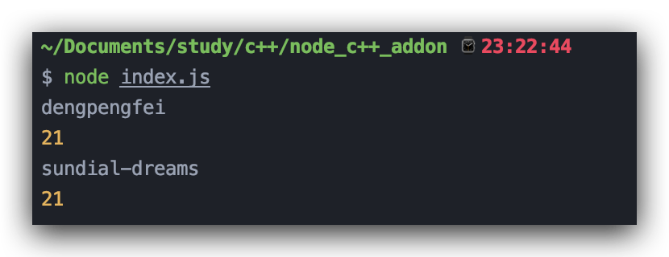

#### libuv

libuv作为Node.js的另一大依赖库，为Node.js提供了多操作系统异步操作的抽象。


由于篇幅有限，本文不打算具体介绍libuv，感兴趣的读者可以阅读[libuv官方文档](http://docs.libuv.org/en/v1.x/)

### 基于NAN

在介绍NAN之前，我们来思考使用原生的方式开发Node.js C++插件会出现什么问题

+ 首先就是版本不兼容问题，由于V8在快速迭代，Node.js也跟着V8走，因此V8 API的变化将直接导致现在的Node.js C++插件运行报错，例如上面写的代码在Node.js v12上可以稳定运行，但是Node.js v10不一定能运行，在Node.js v8一定不能运行（大部分V8 API已经发生变化）。想想自己花大力气写的C++插件不能在其他版本的Node.js上跑，是不是想想就来气💢。
+ 第二点就是V8的API比较复杂，要想写个Node.js C++插件还需要懂V8的一些基本概念（不过看到这了，读者应该理解了一些V8的概念）

在这个前提下，NAN（[Nan官方文档](https://github.com/nodejs/nan)）诞生了。NAN全称是Native Abstraction for Node.js，Node.js原生模块抽象接口集。NAN为跨版本的Node.js提供了稳定的API并且提供一组实用的API来简化一些繁琐的开发流程。

> **官方解释：A header file filled with macro and utility goodness for making add-on development for Node.js easier across versions 0.8, 0.10, 0.12, 1, 2, 3, 4, 5, 6, 7, 8, 9, 10, 11, 12 and 13.**

也就是说Nan就是封装一堆宏和一些工具函数的头文件，这里的宏就是通过Node.js版本判断然后确定展开成何种形式。

#### NAN初体验

+ 安装nan

```bash
npm install --save nan
```

+ 配置binding.gyp

```python
{
  "targets": [
    {
      "target_name": "addon",
      "sources": [
        "nan.cpp"
      ],
      "include_dirs": [
        "<!(node -e \"require('nan')\")"
      ]
    }
  ]
}
```

其实就是多了``` "<!(node -e \"require('nan')\")"```这一行，按照上面介绍的```binding.gyp```语法，这其实是一个指令展开，相当于在命令行下执行```node -e "require('nan')"```，如下

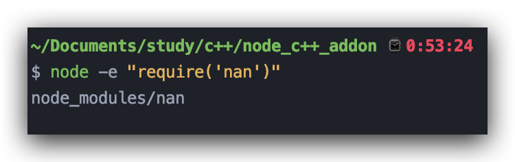

其实就是nan的头文件路径，也就将nan的头文件include进来。修改项目的**CmakeLists.txt**，在原有的基础上添加如下指令

```bash
include_directories(./node_modules/nan)
```

+ 使用nan编写插件

我们```filter```函数为例，使用Nan去实现

```c++
#include <node.h>
#include <nan.h>
using namespace v8;

// 使用 NAN_METHOD宏声明函数，其展开后类似于 void Filter(const FunctionCallbackInfo<Value>& info) {}
NAN_METHOD(Filter) {
  Local<Array> array = info[0].As<Array>();
  Local<Function> fn = info[1].As<Function>();
  Local<Context> context = Nan::GetCurrentContext(); // 每一种v8数据类型在Nan中都有相应的封装
  Local<Array> result = Nan::New<Array>();

  Local<Value> argv[3] = { Nan::New<Object>(), Nan::Null(), array };
  for (uint32_t i = 0, j = 0; i < array->Length(); i++) {
    argv[0] = array->Get(context, i).ToLocalChecked();
    argv[1] = Nan::New<Number>(i);
    Local<Value> v = Nan::Call(fn, Nan::New<Object>(), 3, argv).ToLocalChecked();
    if (v->IsTrue()) {
      result->Set(context, j++, argv[0]).FromJust();
    }
  }

  info.GetReturnValue().Set(result);
}
// 使用NAN_MODULE_INIT去声明Init函数
NAN_MODULE_INIT(Init) {
  Nan::Export(target, "filter", Filter);
}

NODE_MODULE(addon, Init)
```

首先使用```NAN_METHOD```宏来声明一个插件函数，其展开后的形式类似于我们常写的```void Filter(const FunctionCallbackInfo<Value>& info) {}```，其中的```info```就是传进来的参数对象。除此之外Nan还对数据类型的构造进行了相应的封装，通过```Nan::New<Type>()```来获取相应的句柄。用```NAN_MODULE_INIT```宏来创建```Init```函数，```target```其实是```Init```传的参数，类似于```void Init(Local<Object> exports)```的```exports```，然后通过```Nan::Export```来设置模块的导出。

```node-gyp rebuild```构建插件

JavaScript侧

```javascript
const { filter } = require("./build/Release/addon");
console.log(filter([1, 2, 2, 3, 4], (i, v) => v >= 2));
```

执行JavaScript

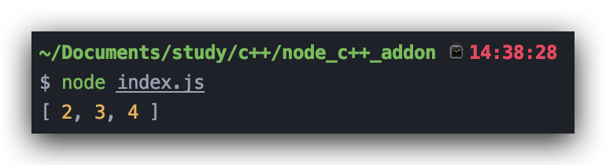

#### Nan基本类型介绍

其实如果读者有了V8的基础的，对于Nan的一些API的理解和会很容易，在Nan中很多东西和V8的API很相近

+ **函数参数类型**

在Nan中对V8的```FunctionCallbackInfo```和```ReturnValue```进行了一个封装，通过```Nan::FunctionCallbackInfo```和```Nan::ReturnValue```来访问。例如

```c++
void Hello(const Nan::FunctionCallbackInfo<Value>& args) {
  args.GetReturnValue().Set(Nan::New("Hello World").ToLocalChecked());
}
```

+ **数据类型**

在Nan中使用```Nan::New<Type>()```来创建对应类型的句柄，比如```Nan::New<Number>(12)```，除此之外还有```Nan::Undefined()```，```Nan::Null()```，```Nan::True()```，```Nan::False()```，```Nan::EmptyString()```。并且使用```Nan::To<Type>()```来做数据类型转换。

+ **句柄作用域**

即```Nan::HandleScope```和```Nan::EscapableHandleScope```，Nan对V8中的```HandleScope```和```EscapableHandleScope```做了一个封装

+ **持久句柄**

  即```Nan::Persistent```和```Nan::Global```，由于V8API一直在变化，因此Nan也对V8的```Persistent/Global```句柄进行了封装

+ **脚本**

对V8的```Script```的封装，包括```Nan::CompileScript()```和```Nan::RunScript()```，读者可以尝试使用Nan的方式实现上文的```Eval```

+ **助手函数**

还记得模版不，即```FunctionTemplate```和```ObjectTemplate```，每次对模版进行操作时都比较繁琐，因此Nan对这些操作进行了一个封装来简化模版操作流程，

```Nan::SetMethod()```: 为对象句柄设置函数

```Nan::Set()/Nan::Get()/Nan::Has()/Nan::Delete()```: 对象句柄设置/获取/键是否存在/删除键

以```createObject```函数举个例子

```c++
void CreateObject(const Nan::FunctionCallbackInfo<Value>& info) {
  Local<Object> object = Nan::New<Object>();
  // 给对象设置属性
  Nan::Set(object, Nan::New("name").ToLocalChecked(), info[0].As<String>());
  Nan::Set(object, Nan::New("age").ToLocalChecked(), info[1].As<Number>());
  // 给对象设置函数
  Nan::SetMethod(object, "getAll", [](const Nan::FunctionCallbackInfo<Value>& args) -> void {
    Local<Object> self = args.Holder();
    Local<String> name = Nan::Get(self, Nan::New("name").ToLocalChecked()).ToLocalChecked().As<String>();
    Local<Number> age = Nan::Get(self, Nan::New("age").ToLocalChecked()).ToLocalChecked().As<Number>();
    Nan::Utf8String n(name); // 使用Nan::Utf8String
    int a = int(age->Value());
    
    char result[1024];
    sprintf(result, "{ name: %s, age: %d }", *n, a);
    args.GetReturnValue().Set(Nan::New(result).ToLocalChecked());
  });

  info.GetReturnValue().Set(object);
}
```

```Nan::SetPrototypeMethod()```: 为函数模版设置原型方法

```Nan::SetPrototype()```: 为函数模板设置原型属性

例如

```c++
Local<FunctionTemplate> fnTemplate = Nan::New<FunctionTemplate>();
Nan::SetPrototype(fnTemplatem, "name", Nan::New("fff").ToLocalChecked());
Nan::SetPrototype(fnTemplatem, "age", Nan::New(2));
Nan::SetPrototypeMethod(fnTemplate, "getAll", GetAll);
```

```Nan::Call```: 一个以同步的方式进行函数调用的工具方法，函数原型如下

```c++
inline MaybeLocal<v8::Value> Call(v8::Local<v8::Function> fun, v8::Local<v8::Object> recv, int argc, v8::Local<v8::Value> argv[])
```

#### Nan::ObjectWrap

对```node::ObjectWrap```的封装，并且添加了一些API去适配低版本的Node.js，回到使用```node::ObjectWrap```来包装的```Person```类，使用Nan去实现就是

```c++
#include <iostream>
#include <string>
#include <node.h>
#include <nan.h>

using namespace v8;
// Person Class, extends Nan::ObjectWrap
class Person : public Nan::ObjectWrap {
  public:
    static NAN_MODULE_INIT(Init) { // void Init(Local<Object> exports)
      Local<FunctionTemplate> fnTemplate = Nan::New<FunctionTemplate>(New);
      fnTemplate->SetClassName(Nan::New("Person").ToLocalChecked());
      fnTemplate->InstanceTemplate()->SetInternalFieldCount(1);
      Nan::SetPrototypeMethod(fnTemplate, "getName", GetName);
      Nan::SetPrototypeMethod(fnTemplate, "getAge", GetAge);
      constructor().Reset(Nan::GetFunction(fnTemplate).ToLocalChecked()); // save a constructor function in global
      Nan::Set(target, Nan::New("Person").ToLocalChecked(), Nan::GetFunction(fnTemplate).ToLocalChecked());
    }

  private:
    explicit Person(const char* name, int age) : name(name), age(age) {}

    static NAN_METHOD(New) { // void New(const FunctionCallbackInfo<Value>& args)
      if (info.IsConstructCall()) {
        Local<String> name = info[0].As<String>();
        Local<Number> age = info[1].As<Number>();
        Nan::Utf8String n(name);
        int a = int(age->Value());
        auto person = new Person(*n, a);
        person->Wrap(info.This()); // like node::ObjectWrap
        info.GetReturnValue().Set(info.This());
        return;
      }
      const int argc = 2;
      Local<Value> argv[argc] = {info[0], info[1]};
      Local<Function> c = Nan::New(constructor());
      info.GetReturnValue().Set(Nan::NewInstance(c, argc, argv).ToLocalChecked());
    }

    static NAN_METHOD(GetName) {
      auto person = static_cast<Person*>(Nan::ObjectWrap::Unwrap<Person>(info.Holder()));
      info.GetReturnValue().Set(Nan::New(person->name.c_str()).ToLocalChecked());
    }

    static NAN_METHOD(GetAge) {
      auto person = static_cast<Person*>(Nan::ObjectWrap::Unwrap<Person>(info.Holder()));
      info.GetReturnValue().Set(Nan::New(person->age));
    }
    // define a global handle of constructor
    static inline Nan::Global<Function>& constructor() {
      static Nan::Global<Function> _constructor; // global value
      return _constructor;
    }

    std::string name;
    int age;
};

NODE_MODULE(nan_addon02, Person::Init)

```

其大部分写法都与```node::ObjectWrap```一样，只不过用宏去替代，在```node::ObjectWrap```实现的```Person```类中，使用对象的内置字段来保存```constructor```的，就是```data->SetInternalField(0, constructor);```。而在Nan中直接就用一个```Global```句柄来保存```constructor```。除了这个不一样外，其他写法与```node::ObjectWrap```基本一样。

### 基于N-API

N-API（[N-API文档](https://nodejs.org/dist/latest-v12.x/docs/api/n-api.html)）是用于构建本地插件的API，基于C语言，独立于JavaScript运行时（V8），并且作为Node.js的一部分进行维护。该APi在所有版本的Node.js都是稳定的应用程序二进制接口（ABI）。旨在使插件于基础的JavaScript引擎（V8）的更改保持隔离，并且在不重新编译的前提下，在Node.js更高的版本下运行。

N-API提供的API通常用于创建和操作JavaScript值，其API有一下特点

+ N-API是C风格的API，很多函数也是C风格的💢

+ 所有N-API调用均返回类型为```napi_status```的状态代码。表示API是否调用成功
+ API的返回值通过out参数传递（函数的返回值已经是```napi_status```了，所以只能通过指针来接正常的返回值）
+ 所有JavaScript值都被名为```napi_value```类型封装，可以理解为JavaScript里的```var/let```
+ 如果API的调用得到得到错误的状态代码。则可以使用```napi_get_last_error_info```来获取最后的出错信息

#### N-API尝鲜

本文依然以实现```filter```函数为例，来尝试一把N-API

首先是修改binding.gyp（N-API也是可以直接使用node-gyp构建的）

```python
{
  "targets": [
    {
      "target_name": "addon",
      "sources": [
        "napi.cpp"
      ]
    }
  ]
}
```

使用N-API实现```filter```函数

```c++
#include <node.h>
#include <node_api.h>
#include <cstdio>
#include <cstdlib>
// 为每一次的napi调用的status判断写成一个宏，call为调用结果
#define NAPI_CALL(env, call)                                   \
     do {                                                      \
       napi_status status = (call);                            \
       if (status != napi_ok) {                                \
         const napi_extended_error_info* error_info = nullptr; \
         napi_get_last_error_info((env), &error_info);         \
         bool is_pending;                                      \
         napi_is_exception_pending((env), &is_pending);        \
         if (!is_pending) {                                    \
           const char* message = error_info->error_message;    \
           napi_throw_error((env), "ERROR", message);          \
           return nullptr;                                     \
         }                                                     \
       }                                                       \
    } while(false)


napi_value filter(napi_env env, napi_callback_info info) {
  size_t argc = 2;
  napi_value argv[2];
  // 拿到参数args
  NAPI_CALL(env, napi_get_cb_info(env, info, &argc, argv, nullptr, nullptr));
  napi_value arr = argv[0], fn = argv[1];
  // 获取传入的数组长度
  uint32_t length = 0;
  NAPI_CALL(env, napi_get_array_length(env, arr, &length));
  // 创建存结果的数组
  napi_value result;
  NAPI_CALL(env, napi_create_array(env, &result));
  napi_value fn_argv[3] = { nullptr, nullptr, arr };

  for (uint32_t i = 0, j = 0; i < length; i++) {
    napi_value fn_ret;
    uint32_t fn_argc = 3;
    napi_value index, arr_val;
    // 拿到数组第i项
    NAPI_CALL(env, napi_get_element(env, argv[0], i, &arr_val));
    // 将i封装成napi_value类型
    NAPI_CALL(env, napi_create_int32(env, (int32_t) i , &index));
    fn_argv[0] = arr_val;
    fn_argv[1] = index;
    // 回调函数调用
    NAPI_CALL(env, napi_call_function(env, arr, fn, fn_argc, fn_argv, &fn_ret));
    // 拿到调用结果
    bool ret;
    NAPI_CALL(env, napi_get_value_bool(env, fn_ret, &ret));
    if (ret) {
      // 为结果数组设置值
      NAPI_CALL(env, napi_set_element(env, result, j++, arr_val));
    }
  }
  return result;
}

napi_value init(napi_env env, napi_value exports) {
  // 将上面的filter函数封装成napi_value类型
  napi_value filter_fn;
  napi_create_function(env, "filter", NAPI_AUTO_LENGTH, filter, nullptr, &filter_fn);
  napi_set_named_property(env, exports, "filter", filter_fn);
  return exports;
}
// 使用NAPI_MODULE来初始化宏（不是NODE_MODULE）
NAPI_MODULE(addon, init)
```

对于每一次的N-API调用都要拿返回的status进行判断，类似于下面的代码

```c++
napi_status status1 = napi_get_cb_info(env, info, &argc, argv, nullptr, nullptr);
if (status1 != napi_ok) {
  // error handle
  return nullptr;
}
```

每一个调用都要写这种代码显然是不现实的，所以将这种N-API的调用以及错误处理封装成一个宏，也就是上面的```NAPI_CALL```宏，外层的```do { } while(0)```其实是给```NAPI_CALL```后面加分号用的😊。```filter```函数的实现思路和之前将的实现思路是一样的，只不过用的API不一样而已，比如获取参数不再是```args[0]/args[1]```，而是```  napi_get_cb_info(env, info, &argc, argv, nullptr, nullptr);```，```argv[0]/argv[1]```，以及函数调用和相应类型的创建都换成了N-API。

```node-gyp rebuild```构建插件

JavaScript侧

```javascript
const { filter } = require("./build/Release/addon");
console.log(filter(["abc", 1, 3, "hello", "b", true], (v, i) => (typeof v === "string")));
```

执行结果

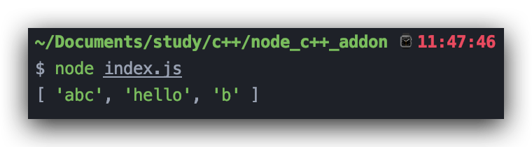

#### N-API基本介绍

+ **基本数据类型**

  1. ```napi_status```:  表示一个N-API调用成功或者失败的状态代码，它是个枚举类型，取值比较多，这里就不一一列举了，比较常用的就是```napi_ok```用来检查是否调用成功

  2. ```napi_env```: 表示底层N-API的特定状态上下文。

  3. ```napi_value```: 一个抽象数据类型，表示JavaScript值。并且可以使用```napi_get_...```等API来获取实际的值，比如

  ```c++
  bool ret;
  NAPI_CALL(env, napi_get_value_bool(env, fn_ret, &ret)); // 上面的NAPI_CALL宏
  ```

  4. ```napi_handle_scope```: 一般句柄作用域类型，类似于```v8::HandleScope```，不过得使用```napi_open_handle_scope()/napi_close_handle_scope()```一开一合来使用句柄作用域。

  ```c++
  {
      napi_handle_scope scope;
  	  NAPI_CALL(env, napi_open_handle_scope(env, &scope));
      // do something
      NAPI_CALL(env, napi_close_handle_scope(env, scope));
  }
  ```

  

  5. ```napi_escapable_handle_scope```: 可逃句柄作用域类型，也是类似于```v8::EscapableHandleScope```，依然使用```napi_open_escapable_handle_scope()/napi_close_escapable_handle_scope()```来打开或者关闭句柄作用域，并且使用```napi_escape_handle()```来让一些句柄逃离当前作用域，类比于```scope.Escape(result)```

  ```c++
  napi_value make_string(napi_env env, const char* name) {
    napi_escapable_handle_scope handle_scope;
    NAPI_CALL(env, napi_open_escapable_handle_scope(env, &handle_scope));
    napi_value val = nullptr;
    // create一个string
    NAPI_CALL(env, napi_create_string_utf8(env, name, NAPI_AUTO_LENGTH, &val));
    napi_value ret = nullptr;  // 保存escape后的句柄
    NAPI_CALL(env, napi_escape_handle(env, handle_scope, val, &ret));
    NAPI_CALL(env, napi_close_escapable_handle_scope(env, handle_scope));
    return ret;
  }
  ```

  

  6. ```napi_callback/napi_callback_info```: 类比于```v8::FunctionCallback/v8::FunctionCallbackInfo```，```napi_callback```函数定义如下

  ```c++
  typedef napi_value (*napi_callback)(napi_env env, napi_callback_info info);
  ```

  感觉是不是很熟悉，和```v8::FunctionCallback```似乎是一个意思，里面的```napi_callback_info```也是参数信息

  可以用```napi_get_cb_info()```函数来获取相应的参数信息，该函数原型如下

  ```c++
  napi_status napi_get_cb_info(
      napi_env env,               // [in] NAPI environment 句柄
      napi_callback_info cbinfo,  // [in] callback-info 句柄
      size_t* argc,      // [in-out] 参数个数
      napi_value* argv,  // [out] 参数数组
      napi_value* this_arg,  // [out] 当前函数的this
      void** data);          // [out] data指针类似于v8的args.Data();
  ```

  举个例子

  ```c++
  size_t argc = 2;
  napi_value argv[2], self;
  NAPI_CALL(env, napi_get_cb_info(env, info, &argc, argv, &self, nullptr));
  ```

  

  7. ```napi_extended_error_info```: 错误类型，用于从```napi_get_last_error_info()```里获取错误信息，该函数的第二个参数就是这个```napi_extended_error_info```类型的。

+ **创建N-API(JavaScript)类型**

  类比于```v8::Number::New()```来创建数值类型，N-API也提供了一些函数来创建一些常用的JavaScript类型

  1. ```napi_create_array/napi_create_array_with_length```: 创建数组

  ```c++
  napi_value array = nullptr;
  NAPI_CALL(env, napi_create_array(env, &array)); // 不定长数组
  napi_value array_1024 = nullptr;
  NAPI_CALL(env, napi_create_array_with_length(env, 1024, &array_1024)); // 定长数组
  ```

  2. ```napi_create_object```: 创建对象

  ```c++
  napi_value object = nullptr;
  NAPI_CALL(env, napi_create_object(env, &object));
  ```

  3. ```napi_create_int32/napi_create_uint32/napi_create_int64/napi_create_double```: 创建数值类型

  ```c++
  int val = 32;
  napi_value number = nullptr;
  NAPI_CALL(env, napi_create_int32(env, (int_32)val, &number)); //
  ```

  4. ```napi_create_string_utf8```: 创建字符串

  ```c++
  napi_value str = nullptr;
  // 其中第三个参数的字符串长度，NAPI_AUTO_LENGTH表示遍历字符串，但遇到null时终止
  NAPI_CALL(env, napi_create_string_utf8(env, "hello world", NAPI_AUTO_LENGTH, &str));
  ```

  

  5. ```napi_create_function```: 利用```napi_callback```类型创建一个函数，函数原型定义如下

  ```c++
  napi_status napi_create_function(napi_env env,
                                   const char* utf8name, // 字符串函数名
                                   size_t length, // utf8name的长度，NAPI_AUTO_LENGTH
                                   napi_callback cb, // 相应的函数
                                   void* data, // 传到napi_callback_info类型里data字段
                                   napi_value* result); // [out] 结果
  ```

  举个例子

  ```c++
  napi_status filter_fn = nullptr;  
  napi_create_function(env, "filter", NAPI_AUTO_LENGTH, filter, nullptr, &filter_fn);
  ```

  

  4. ```napi_get_boolean/napi_get_global/napi_get_null/napi_get_undefined```: 这些函数写的那么直白，就不需要解释了

  ```c++
  napi_value bool_val = nullptr;
  NAPI_CALL(env, napi_get_boolean(env, false, &bool_val)); // get false;
  
  napi_value global = nullptr;
  NAPI_CALL(env, napi_get_global(env, &global)); // get global对象
  
  napi_value undefined = nullptr;
  NAPI_CALL(env, napi_get_undefined(env, &undefined)); // get undefined
  
  napi_value null_val = nullptr;
  NAPI_CALL(env, napi_get_null(env, &null_val)); // get null
  ```

+ **N-API类型到C类型的转换**

  将```napi_value```转化为C类型以方便操作

  1. ```napi_get_value_bool```: 获取```bool```类型，其函数原型如下

  ```c++
  napi_status napi_get_value_bool(napi_env env,
                                  napi_value value, // 对于的句柄
                                  bool* result); // [out] 输出对应的bool值
  ```

  2. ```napi_get_value_double/napi_get_value_int32/napi_get_value_int64```: 获取```double/int32/int64```类型

  ```c++
  double val;
  napi_value double_val = nullptr;
  NAPI_CALL(env, napi_create_double(env, 233.2, &double_val));
  NAPI_CALL(env, napi_get_value_double(env, double_val, &val)); // get double
  printf("%f\n", val);
  ```

  3. ```napi_get_value_string_utf8```: 获取字符串，其函数原型如下

  ```c++
  napi_status napi_get_value_string_utf8(napi_env env,
                                         napi_value value, // JavaScript侧字符串
                                         char* buf, // 缓冲区
                                         size_t bufsize, // 缓冲区长度 
                                         size_t* result); // [out] 结果字符串长度
  ```

  例如

  ```c++
  napi_value str_val = make_string(env, "hello world!");
  char str[1024];
  size_t str_size;
  NAPI_CALL(env, napi_get_value_string_utf8(env, str_val, str, 1024, &str_size));
  for (size_t i = 0; i < str_size; i++) {
    printf("%c", str[i]);
  }
  printf("\n");
  ```

+ **JavaScript类型操作**

  即对JavaScript值执行一些抽象的操作，包括: **将JavaScript值强制转换为特定类型的JavaScript值**，**检查JavaScript值的类型**，**检查两个JavaScript值是否相等**。部分函数比较简单，就直接写函数原型了

  1. ```napi_coerce_to_bool/napi_coerce_to_number/napi_coerce_to_object/napi_coerce_to_string```: 强制转换为```bool/number/object/string```，类比于```v8::Local<Boolean>::Cast()```等，例如下面的JavaScript语句

  ```javascript
  var a = Boolean(b);
  ```

  使用N-API实现就是

  ```c++
  napi_value a;
  NAPI_CALL(env, napi_coerce_to_bool(env, b, &a));
  ```

  2. ```napi_typeof```: 类似于JavaScript侧的```typeof```运算，其函数原型如下

  ```c++
  napi_status napi_typeof(napi_env env, 
                          napi_value value,
                          napi_valuetype* result); // napi_valuetype是JavaScript数据类型的枚举，取值为: napi_string | napi_null | napi_object等
  ```

  3. ```napi_instanceof```: 类似于JavaScript侧的```instanceof```运算，其函数原型如下

  ```c++
  napi_status napi_instanceof(napi_env env,
                              napi_value object, // 对象
                              napi_value constructor, // 构造函数
                              bool* result); //[out] 结果
  ```

  4. ```napi_is_array```: 类似于JavaScript里的```Array.isArray()```，函数原型如下

  ```c++
  napi_status napi_is_array(napi_env env,
                            napi_value value,
                            bool* result); // [out] 结果
  ```

  5. ```napi_strict_equals```: 判断两JavaScript值是否严格相等```===```，其函数原型如下

  ```c++
  napi_status napi_strict_equals(napi_env env,
                                 napi_value lhs, // 左值
                                 napi_value rhs, // 右值
                                 bool* result); // [out] 结果
  ```

+ **句柄作用域** 

  即```napi_handle_scope```和```napi_escapable_handle_scope```，上文对这两个做了解释和相应的用法，这里就不在赘述了。

+ **对象操作**

  对于对象，N-API也封装了一些方法去操作，首先来看两个有用的类型，```napi_property_attributes```和```napi_property_descriptor```

  1. ```napi_property_attributes```: 用于控制在对象设置的属性的行为的标志，可枚举/可配置/可写等，所以它是个枚举类型

  ```c++
  typedef enum {
    napi_default = 0, // 默认值，属性只读，不可枚举，不可配置
    napi_writable = 1 << 0, // 属性可写
    napi_enumerable = 1 << 1, // 属性可枚举
    napi_configurable = 1 << 2, // 属性可配置
    napi_static = 1 << 10, // 类的静态属性，napi_define_class时会用到这个
  } napi_property_attributes;
  ```

  

  2. ```napi_proptery_descriptor```: 属性结构体，包含属性名，具体的值，```getter/setter```方法等

  ```c++
  typedef struct {
    const char* utf8name; // 属性名 utf8name和name必须提供一个
    napi_value name; // 属性名 utf8name和name必须提供一个
    napi_callback method; // 属性值函数，如果提供了这个，则value和getter和setter必须是null
    napi_callback getter; // getter函数，如果有这个，则value和method必须是null
    napi_callback setter; // setter函数，如果有这个，则value和method必须是null
    napi_value value; // 属性值 如果有这个，则getter和setter和method和data必须是null
    napi_property_attributes attributes; // 属性的行为标志
    void* data; // 这个数据会传到method，getter，setter
  } napi_property_descriptor;
  ```

  3. ```napi_define_properties```: 为对象定义属性，类似于JavaScript中的```Object.defineProperties()```，其函数原型如下

  ```c++
  napi_status napi_define_properties(napi_env env,
                                     napi_value object, // 对象
                                     size_t property_count, // 属性个数
                                     const napi_property_descriptor* properties); // 属性数组
  ```

  现在又来实现一遍```createObject```函数，不过这次是基于```Object.defineProperties()```来实现的，类似于下面的JavaScript代码

  ```javascript
  function createObject(name, age) {
      let object = {};
      Object.defineProperties(object, {
          name: { enumerable: true, value: name },
          age: { enumerable: true, value: age },
      });
      return object;
  }
  ```

  现在使用N-API实现这个函数就是

  ```c++
  napi_value create_object(napi_env env, napi_callback_info info) {
    size_t argc;
    napi_value args[2], object;
    NAPI_CALL(env, napi_get_cb_info(env, info, &argc, args, nullptr, nullptr));
    NAPI_CALL(env, napi_create_object(env, &object));
    napi_property_descriptor descriptors[] = {
            {"name", 0, 0, 0, 0, args[0], napi_enumerable, 0},
            {"age", 0, 0, 0, 0, args[1], napi_enumerable, 0}
    };
    NAPI_CALL(env, napi_define_properties(env, object, sizeof(descriptors) / sizeof(descriptors[0]), descriptors));
    return object;
  }
  ```

  4. ```napi_get_property_names```: 获取一个对象的所有属性名，其函数原型如下

  ```c++
  napi_status napi_get_property_names(napi_env env,
                                      napi_value object, // 对象
                                      napi_value* result); // 返回的结果，将会是一个数组
  ```

  例子

  ```c++
  napi_value prop_list = nullptr; 
  NAPI_CALL(env, napi_get_property_names(env, object, &prop_list)); // 返回prop_list将是一个array
  ```

  5. ```napi_set_property/napi_get_property/napi_has_property/napi_delete_property/napi_has_own_property```: 分别是设置对象属性/获取对象属性/判断对象是否存在某个属性/删除对象属性/判断对象的属性是否是自己的属性（非原型属性）。这个比较简单，就直接贴上这些函数的原型了

  ```c++
  napi_status napi_set_property(napi_env env,
                                napi_value object, // 对象
                                napi_value key, // 键
                                napi_value value); // 值
  
  napi_status napi_get_property(napi_env env, 
                                napi_value object, // 对象
                                napi_value key, // 键
                                napi_value* result); // [out] 属性值
  
  napi_status napi_has_property(napi_env env,
                                napi_value object, // 对象
                                napi_value key, // 键
                                bool* result); // [out] 判断结果
  
  napi_status napi_delete_property(napi_env env,
                                   napi_value object, // 对象
                                   napi_value key, // 键
                                   bool* result); // [out] 删除是否成功
  
  napi_status napi_has_own_property(napi_env env,
                                    napi_value object, // 对象
                                    napi_value key, // 键
                                    bool* result); // [out] 判断结果
  ```

  

  6. ```napi_set_named_property/napi_get_named_property/napi_has_named_property```: 也是设置对象属性/获取对象属性/判断对象属性是否存在，不过与上面的不同的是，```key```是一个```const char*```类型的，在某些场景下也是也比较有用，其函数原型如下

  ```c++
  napi_status napi_set_named_property(napi_env env,
                                      napi_value object, // 对象
                                      const char* utf8Name, // 键
                                      napi_value value); // 属性值
  napi_status napi_get_named_property(napi_env env, 
                                      napi_value object, // 对象
                                      const char* utf8Name, // 键
                                      napi_value* result); // [out] 返回的属性值
  napi_status napi_has_named_property(napi_env env,
                                      napi_value object, // 对象
                                      const char* utf8Name, // 键
                                      bool* result); // [out] 判断结果
  ```

  

  7. ```napi_set_element/napi_get_element/napi_has_element/napi_delete_element```: 也是设置对象的属性值/获取对象的属性值/判断对象属性值是否存在/删除对象的属性值，这里的函数```key```是一个```uint32_t```类型的，比较适用于数组，其函数原型如下

  ```c++
  napi_status napi_set_element(napi_env env,
                               napi_value object, // 对象
                               uint32_t index, // 键/索引
                               napi_value value); // 值
  
  napi_status napi_get_element(napi_env env,
                               napi_value object, // 对象
                               uint32_t index, // 键/索引
                               napi_value* result); // [out] 属性值
  
  napi_status napi_has_element(napi_env env,
                               napi_value object, // 对象
                               uint32_t index, // 键/索引
                               bool* result); //[out] 判断结果
  
  napi_status napi_delete_element(napi_env env,
                                  napi_value object, // 对象
                                  uint32_t index, // 键/索引
                                  bool* result); // [out] 删除是否成功
  ```

  

+ **函数操作**

  主要是函数的创建和调用以及当作构造函数来使用

  1. ```napi_create_function```: 该方法在上文已经提到过了，这里就不在赘述。
  2. ```napi_function_call```: 调用函数，其函数原型如下

  ```c++
  napi_status napi_call_function(napi_env env,
                                 napi_value recv, //JavaScript侧的this对象
                                 napi_value func, // 函数
                                 size_t argc, // 传入函数的参数个数
                                 const napi_value* argv, // 传入函数的参数
                                 napi_value* result); // [out] 函数调用结果
  ```

  例子的话，可以参考上面的```filter```函数的实现

  3. ```napi_new_target```: 相当于JavaScript侧的```new.target```判断当前是否以构造函数的方式调用，还记得```Person```类嘛，现在使用N-API实现一下

  ```c++
  napi_value person(napi_env env, napi_callback_info info) {
    size_t argc;
    napi_value args[2], self, target;
    NAPI_CALL(env, napi_get_new_target(env, info, &target));
    if (target == nullptr) { // 非new调用
      napi_throw_error(env, "ERROR", "need new");
      return nullptr;
    }
    NAPI_CALL(env, napi_get_cb_info(env, info, &argc, args, &self, nullptr));
    NAPI_CALL(env, napi_set_named_property(env, self, "name", args[0]));
    NAPI_CALL(env, napi_set_named_property(env, self, "age", args[1]));
    return self;
  }
  ```

  使用```napi_new_target```判断是否用```new```进行调用函数，如果以```new```调用的话，即```new Person("aaa", 21)```则我们能得到正确的结果

  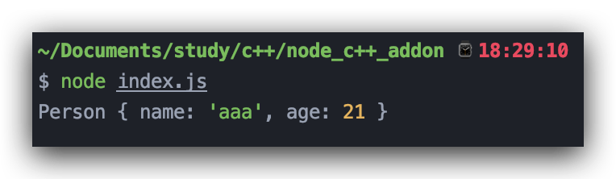

  否则```Person("aaa", 21)```直接调用就抛异常

  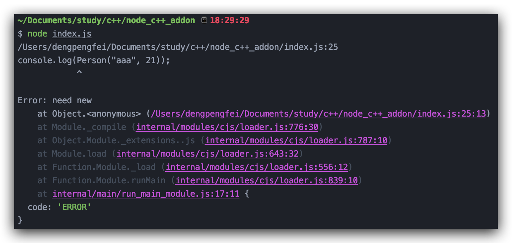

  4. ```napi_new_instance```: 即以构造函数的方式来调用函数并产生实例，其函数原型如下

  ```c++
napi_status napi_new_instance(napi_env env,
                                napi_value constructor, // 构造函数
                                size_t argc, // 参数个数
                                const napi_value* argv, // 参数
                                napi_value* result); // 以及实例(new)出来的对象
  ```
  
  根据上面实现的```Person```类，我们可以实现一个```createPerson```的函数，类似于JavaScript侧的

  ```javascript
function createPerson(name, age) { return new Person(name, age) }
  ```
  
  C++代码如下

  ```c++
napi_value create_person(napi_env env, napi_callback_info info) {
    size_t argc = 2;
    napi_value args[2], instance = nullptr, constructor = nullptr;
    NAPI_CALL(env, napi_get_cb_info(env, info, &argc, args, nullptr, nullptr));
    NAPI_CALL(env, napi_create_function(env, "Person", NAPI_AUTO_LENGTH, person, nullptr, &constructor));
    NAPI_CALL(env, napi_new_instance(env, constructor, argc, args, &instance));
    return instance;
  }
  ```
  


### 基于node-addon-api

由于N-API是Node.js v8版本才出的特性，那么在Node.js v8以下的版本都无法运行，这个问题和原生扩展一样，因此就出现了node-addon-api包。node-addon-api（[node-addon-api官方文档](https://github.com/nodejs/node-addon-api)）是对N-API的C++包装，基于N-API包装了一些低开销包装类使得能使用C++类等特性来简化N-API的使用，并且打包的插件能跨多个Node.js版本运行。

#### node-addon-api上手

+ **node-addon-api安装**： 和Nan一样，安装后是一堆头文件和C++源文件

```bash
npm install --save node-addon-api
```

+ **修改binding.gyp**

```python
{
  "targets": [
    {
      "target_name": "addon",
      "include_dirs": [
        "<!@(node -p \"require('node-addon-api').include\")"
      ],
      # 添加下面的依赖库，根据当前Node.js版本判断
      "dependencies": [
        "<!(node -p \"require('node-addon-api').gyp\")"
      ],
      "cflags!": ["-fno-exceptions"],
      "cflags_cc!": ["-fno-exceptions"],
      "defines": [
        "NAPI_DISABLE_CPP_EXCEPTIONS" # 记得加这个宏
      ],
      "sources": [
        "node_addon_api.cpp"
      ]
    }
  ]
}
```

和Nan一样也是将node-addon-api的头文件加到```include_dirs```下，其实```require('node-addon-api')```就是把```node-addon-api/index.js```给```require```过来

```javascript
var path = require('path');

var versionArray = process.version
  .substr(1)
  .replace(/-.*$/, '')
  .split('.')
  .map(function(item) {
    return +item;
  });
// node版本检查，判断是否有N-API
var isNodeApiBuiltin = (
  versionArray[0] > 8 ||
  (versionArray[0] == 8 && versionArray[1] >= 6) ||
  (versionArray[0] == 6 && versionArray[1] >= 15) ||
  (versionArray[0] == 6 && versionArray[1] >= 14 && versionArray[2] >= 2));

var needsFlag = (!isNodeApiBuiltin && versionArray[0] == 8);
// 当前目录
var include = [__dirname];
// 对于低版本的node，dependencies需要的.gyp文件
var gyp = path.join(__dirname, 'src', 'node_api.gyp');
// 判断是否有N-API
if (isNodeApiBuiltin) {
  gyp += ':nothing';
} else {
  gyp += ':node-api';
  include.unshift(path.join(__dirname, 'external-napi'));
}

module.exports = {
  include: include.map(function(item) {
    return '"' + item + '"';
  }).join(' '),
  gyp: gyp,
  isNodeApiBuiltin: isNodeApiBuiltin,
  needsFlag: needsFlag
};

```

然后对于低版本的Node.js，需要加上```dependencies```字段，其实也就是将```node-addon-api/src/node_api.cc```和```node-addon-api/src/node_internals.cc```给引入进来，对高版本的Node.js就什么不做，可以参考```node-addon-api/src/node_api.gyp```。接着修改**CMakeLists.txt**，将```node-addon-api```的头文件目录给引进来，也就是添加下面的指令。

```bash
include_directories(./node_modules/node-addon-api)
```

+ **又是```filter```函数**: （至少比"hello world！"有水平😭）

```c++
#include <napi.h>
using namespace Napi;
// 类似于N-API的写法
Array Filter(const CallbackInfo &info) {
  Env env = info.Env(); // 类似于N-API里面的env
  Array result = Array::New(env);
  Array arr = info[0].As<Array>(); // 类似于v8
  Function fn = info[1].As<Function>();
  for (size_t i = 0, j = 0; i < arr.Length(); i++) {
    // 函数调用可以用 initializer_list 这点很好
    Boolean ret = fn.Call(arr, {arr.Get(i), Number::New(env, i), arr}).As<Boolean>();
    if (ret.Value()) {
      result.Set(j++, arr.Get(i));
    }
  }
  return result;
}

// 类似于N-API的init函数写法
Object Init(Env env, Object exports) {
  exports.Set("filter", Function::New(env, Filter));
  return exports;
}
// 使用的是NODE_API_MODULE宏
NODE_API_MODULE(addon, Init)
```

假设读者认真的阅读了上面的**v8**和**N-API**的内容，对v8类型和N-API有了个初步的认识，那么我觉得很容易就能看懂上面的代码，就是N-API换成了类似于v8类型的名字而已。

#### node-addon-api介绍

从上面的```filter```函数可以看到，```node-addon-api```的数据类型，以及一些用法和v8的非常相像

+ **基本数据类型**

  1. **Value**: 所有类型的抽象(父类)，是对```napi_value```的一个封装。常用API有

     ```value.As<Type>()```: 数据类型转换，类似于v8的```As```方法。

     ```value.Is...()```: 数据类型判断，比如```value.IsFunction()```, ```value.IsNull()```等

     ```value.To...()```: 数据类型转换，比如```value.ToBoolean()```,```value.ToNumber()```等

     ```napi_value(value)```: 将```Value```转化回```napi_value```类型，重载函数声明如下

     ```c++
     operator napi_value() const;
     ```

     在下面的类型中也有类似的重载代码，比如```operator std::string() const;```这样的函数来将Napi里的数据类型转化到C++的数据类型。

  2. **Object**: 对象类型，继承自```Value```。

     ```Object::New()```: 创建一个对象，是静态函数，```Object::New(env)```

     ```obj.Set()```: 给对象设置属性，重载的比较多，比如

     ```c++
     Object obj = Object::New(env);
     obj.Set("name", "sundial-dreams");
     obj.Set(21, "age");
     obj.Set(String::New(env, "age"), Number::New(env, 21));
     ```

     键可以是```napi_value | Napi::Value | const char* | const std::string& | uint32_t```类型，值可以是```napi_value | Napi::Value | const char* | std::string& | bool | double```类型 

     ```obj.Delete()```: 删除对象的属性，```obj.Delete("name")```，键的类型跟上面的一样

     ```obj.Get()```: 获取对象的属性，```obj.Get(21)```，键的类型跟上面的一样

     ```obj.Has()/obj.HasOwnProperty()```: 这个跟上面是一样的

     ```[]运算符重载```: 也就是说我们可以通过```obj["name"] = "dpf"```的方式去设置或获取属性的值，其中键的类型是```uint32_t | const char* | const std::string&```

     ```obj.GetPropertyNames()```: 返回对象的所有可枚举属性，返回值是一个```Array```类型

     ```c++
     Object object = Object::New(env);
     object["name"] = info[0].As<String>();
     object["age"] = info[1].As<Number>();
     Array attrs = object.GetPropertyNames();
     // "name", "age"
     for (size_t i = 0; i < attrs.Length(); i++) {
       std::cout << std::string(attrs.Get(i).As<String>()) << std::endl;
     }
     ```

     ``` obj.DefineProperty()/obj.DefineProperties()```: 定义属性，```obj.DefineProperty()```的参数是一个```Napi::PropertyDescriptor&```类型，而```obj.DefineProperties()```的参数是```std::initializer_list<Napi::PropertyDescriptor>```或```std::vector<Napi::PropertyDescriptor>```类型，这里提到了```Napi::PropertyDescriptor```类型，可以理解为N-API中的```napi_property_descriptor```的封装。

     ```c++
     Object CreateObject(const CallbackInfo &info) {
       Env env = info.Env();
       Object object = Object::New(env);
       // 定义一个属性，键、值、可枚举
       PropertyDescriptor nameProp = PropertyDescriptor::Value("name", info[0], napi_enumerable);
       PropertyDescriptor ageProp = PropertyDescriptor::Value("age", info[1], napi_enumerable);
       // 定义一个函数属性，键、函数、可枚举
       PropertyDescriptor getAllFn = PropertyDescriptor::Function("getAll", [](const CallbackInfo &args) -> void {
         Object self = args.This().ToObject();
         std::string name = self.Get("name").As<String>(); //隐式类型转换
         int age = self.Get("age").As<Number>();
         std::cout<<name<<" "<<age<<std::endl;
       }, napi_enumerable);
       // 传个initializer_list进去
       object.DefineProperties({ nameProp, ageProp, getAllFn });
       return object;
     }
     ```

  3. **String/Number/Boolean/Array**： 这几个类型也很简单，都是使用```New```函数来构造，```String```类型，可以用```str.Utf8Value()/str.Utf16Value()```来获取字符串值(返回```std::string/std::u16string```类型)，或者直接用显示类型转换```string(str) ```来转换为```std::string```类型。

     ```c++
     String str = String::New(env, "hello world!");
     std::string str1 = str.Utf8Value();
     std::u16string u16Str = str.Utf16Value();
     std::string cpp_str = str; // 隐式类型转换，String 重载了string()类型转换运算符
     std::string cpp_str1 = std::string(str); // 显式类型转换
     std::cout<<str1<<" "<<" "<<cpp_str<<" "<<cpp_str1<<std::endl;
     ```

     ```Number```和```Boolean```也是一样的，所以这里就不在赘述了，最后一个```Array```在```filter```函数里也演示过了。

  4. **Env**: 对N-API ```napi_env```类型的封装，也是可以通过```napi_env(env)```将```Napi::Env```类型转换为```napi_env```

     ，Env类还提供了一些方法，比如```env.Global()```获取```global```对象、```env.Undefined()```获取```undefined```、```env.Null()```获取```null```。

  5. **CallbackInfo**: 跟```v8::FunctionCallbackInfo<Value>```类似，不过它通过以下方法用来拿到一个JavaScript函数的信息

     ```info.Env()```: 拿到```env```对象

     ```info.NewTarget()```: 相当于JavaScript中的```new.target```运算

     ```info.isConstructCall()```: 是否以构造（```new```）函数的方式进行调用

     ```info.Length()```: 传入的参数长度

     ```info[i]```: ```CallbackInfo```重载了```[]```运算符，所以可以通过下标的方式获取第几个参数

     ```info.This()```: 当前函数的```this```

+ **句柄作用域**

  1. **HandleScope**: 类似于```v8::HandleScope```，声明一个```HandleScope```只需要```HandleScope scope(env)```即可

  2. **EscapableHandleScope**: 类似于```v8::EscapableHandleScope```

  ```c++
  Value ReturnValue(Env env) {
    EscapableHandleScope scope(env);
    Number number = Number::New(env, 222);
    return scope.Escape(number); // 类似于v8::EscapableHandleScope的用法
  }
  ```

+ **函数**

即```Napi::Function```类，用于创建JavaScript函数对象，它继承自```Napi::Object```，```Napi::Function```可以用两类C++函数来创建，即```typedef void (*VoidCallback)(const Napi::CallbackInfo& info);```和```typedef Value (*Callback)(const Napi::CallbackInfo& info);```分别是返回```void```和返回```Value```的函数

1. **New**: 从```Callback```或```VoidCallback```类型的C++函数来创建JavaScript函数

```c++
Function fn1 = Function::New(env, OneFunc, "oneFunc");
Function fn2 = Function::New(env, TwoFunc);
```

1. **Call**:调用函数，这个函数重载比较多

```c++
Value Call(const std::initializer_list<napi_value>& args) const; // 使用初始化列表传参数
Value Call(const std::vector<napi_value>& args) const; // 使用vector来传参数
Value Call(size_t argc, const napi_value* args) const; // 直接用数组传参数
Value Call(napi_value recv, const std::initializer_list<napi_value>& args) const; // 绑定this，初始化列表
Value Call(napi_value recv, const std::vector<napi_value>& args) const; // 绑定this，vector
Value Call(napi_value recv, size_t argc, const napi_value* args) const; // 绑定this， 数组
```

例如

```c++
// 使用初始化列表
fn1.Call({Number::New(env, 1), String::New(env, "sss")});
fn1.Call(self, {Number::New(env, 2)});
// 使用vector
std::vector<napi_value> args = {Number::New(env, 222)};
fn1.Call(args);
fn1.Call(self, args);
// 直接用数组
napi_value args2[] = {String::New(env, "func"), Number::New(env, 231)};
fn1.Call(2, args2);
fn1.Call(self, 2, args2);
```

1. **()**重载: 调用函数，函数原型如下

```c++
Value operator ()(const std::initializer_list<napi_value>& args) const;
```

调用如下

```c++
fn1({Number::New(env, 22)});
```

### 总结

本文很多部分其实借鉴了死月大佬的《Node.js来一打C++扩展》，但由于这本书的内容是基于Node.js v6写的，现在Node.js 已经更新到v12了，原生扩展中很多部分都已经发生了变化（本文中的所有示例都是基于Node.js v12）。本文也是大概介绍了Node.js C++插件的一些用途以及Node.js C++插件的基本原理，然后总结出Node.js C++插件开发的四种方式：原生开发、基于Nan、N-API、基于node-addon-api的方式来编写我们的Node.js插件，从中也可以看到Node.js C++插件开发的一些演进。对于每一种开发方式文章中其实也只是简单的介绍了一些API和用法，希望这些内容能让读者对C++插件有个基本的入门，更多的内容还请以官方文档为准。我觉得阻碍学习C++插件开发的不是那些API有多难用，而是可能不会C++😂😂（建议看三遍《C++ Primer Plus》）。

### GitHub地址

 本文所有示例地址：https://github.com/sundial-dreams/node_cpp_addon

### 参考

+ 《Node.js来一打C++扩展》

+ v8文档：https://v8.dev/docs
+ Node.js文档：https://nodejs.org/dist/latest-v12.x/docs/api/addons.html
+ Nan官方文档：https://github.com/nodejs/nan
+ N-API官方文档：https://nodejs.org/dist/latest-v12.x/docs/api/n-api.html
+ node-addon-api官方文档：https://github.com/nodejs/node-addon-api